# Архитектура Пандитджи

Технический документ. Описывает, как реализуется то, что зафиксировано в `panditji-vision.md` и `panditji-summary-v2.md`. Язык генерации сообщений — в `panditji-language-guide-v2.md`.

Документ живой — будет дополняться по мере прохождения фаз.

---

## 1. Принципы

Семь принципов, на которых стоит вся система. Все остальные решения подчиняются им.

### 1.1. Один пользователь — один источник правды

Данные привязаны к **профилю человека**, а не к устройству-источнику. Если Адриан взвесился в Москве на Body Smart, а через два месяца — в Индии на Body Scan, обе записи попадают в **одну таблицу `weight_log` с пометкой локации**. Не «московские весы → одна история, индийские → другая». Один Адриан, одна история.

То же относится ко всем доменам: HRV с Whoop в любой стране, ЭКГ с Body Scan в любое время — всё стекается в **единое представление о теле во времени**.

### 1.2. Автоматизация поверх ручного ввода

Если данные **могут** прийти автоматически — они приходят автоматически. Ручной ввод — только для того, что устройство физически не видит: микро-чек-ин утром, заметка о событии, фото анализа крови.

**Следствие для архитектуры:** для каждого источника данных есть **fetcher** (Edge Function, которая забирает данные сама). Никаких «зайди в приложение и нажми синхронизировать».

### 1.3. Сначала смысл, потом цифры

В интерфейсе **первое, что видит человек** — это **фраза**, а не график. «Спал ровно, HRV крепкий» важнее, чем число «48 ms». Числа доступны на втором экране, для тех, кто хочет углубиться.

**Следствие для архитектуры:** есть отдельный слой генерации **формулировок** (через Claude API), который берёт сырые числа и превращает их в **речь Пандитджи**. Этот слой — обязательная часть, не косметика.

### 1.4. Память важнее интерфейса

Пандитджи **помнит** контекст: что обсуждали вчера, какие у Адриана цели по холестерину, что Москва на нём сказывается тяжелее, чем Индия. Этот контекст **подмешивается** в каждую генерацию сообщения.

**Следствие для архитектуры:** есть отдельный слой `memories` — таблица фактов о пользователе, которые автоматически попадают в системный промпт Claude при каждом обращении к ИИ.

### 1.5. Минимализм и спокойствие

Стилистика — **Apple-подобная**: чистые карточки, мягкие тени, иконки в одной толщине линий. Никаких эмодзи в интерфейсе. Никаких прогресс-баров «вы прошли 47% пути!». Никаких пуш-уведомлений «выпей воды!».

**Следствие для архитектуры:** простой стек на фронте (Vanilla JS или минимальный React), без UI-библиотек со встроенным «коучским» дизайном. Все компоненты — свои, под наш голос.

### 1.6. Telegram как параллельный вход

Веб-приложение и Telegram-бот — **равноценные каналы**. Что можно сделать в вебе, можно сделать в Telegram. Что можно сделать в Telegram, можно сделать в вебе. Никаких функций «только в боте».

**Следствие для архитектуры:** Telegram-бот сидит на **том же бэкенде** и **той же базе данных**, что и веб. Это не два продукта — это два канала одной системы.

### 1.7. Никаких заглушек

Если кнопка есть в интерфейсе — она **работает на реальных данных**. Никаких «потом доделаем», «здесь будет график», «coming soon». Лучше **меньше функций, но работающих**, чем больше — половина из которых пустые.

**Следствие для разработки:** фаза считается завершённой, только когда **каждая включённая в неё функция** работает на реальных данных. Если что-то не успели — оно не в этой фазе.

---

## 2. Общая схема

Карта системы на одной странице. Кто куда ходит, кто что хранит.

### 2.1. Главные узлы

```
┌──────────────────────────────────────────────────────────────┐
│                                                              │
│  ВНЕШНИЕ ИСТОЧНИКИ              SUPABASE CLOUD (Mumbai)      │
│                                 ap-south-1                   │
│                                                              │
│  ┌─────────────┐                ┌─────────────────────┐      │
│  │   Whoop     │ ──── API ───→  │                     │      │
│  │   (cloud)   │                │  ┌───────────────┐  │      │
│  └─────────────┘                │  │  PostgreSQL   │  │      │
│                                 │  │  + PostgREST  │  │      │
│  ┌─────────────┐                │  │  + GoTrue     │  │      │
│  │  Withings   │ ──── API ───→  │  │  + Storage    │  │      │
│  │   (cloud)   │                │  │  + Studio     │  │      │
│  └─────────────┘                │  └───────────────┘  │      │
│                                 │                     │      │
│  ┌─────────────┐                │  ┌───────────────┐  │      │
│  │    Muse     │   Mind Monitor │  │ Edge Funcs    │  │      │
│  │  (телефон)  │ ──→ Drive ───→ │  │ (Deno):       │  │      │
│  └─────────────┘                │  │ - fetchers    │  │      │
│                                 │  │ - cron jobs   │  │      │
│  ┌─────────────┐                │  │ - webhooks    │  │      │
│  │   Google    │ ──── API ───→  │  │ - AI gen      │  │      │
│  │  Calendar   │                │  │ - swiss-eph   │  │      │
│  └─────────────┘                │  └───────────────┘  │      │
│                                 │           ↑         │      │
│  ┌─────────────┐                └───────────│─────────┘      │
│  │ Anthropic   │ ←──── API ─────────────────┘                │
│  │ Claude API  │                            │                │
│  └─────────────┘                            │                │
│                                             │                │
│   ШРСК-СЕРВЕР (вспомогательный)             │                │
│  ┌─────────────────────────────┐            │                │
│  │ Python-jobs (Docker, cron)  │ ──REST API─┘                │
│  │ • gaurabda (раз в месяц)    │  пишет вайшнава-календарь   │
│  │ • PDF-парсер (опционально)  │  в Supabase                 │
│  ├─────────────────────────────┤                             │
│  │ Бэкапы:                     │                             │
│  │ • pg_dump (ежедневно)       │ ←─── REST API connect       │
│  │ • rsync на диск             │                             │
│  ├─────────────────────────────┤                             │
│  │ Uptime Kuma                 │ ──ping──→ Edge Function     │
│  │ + Telegram alerts           │                             │
│  └─────────────────────────────┘                             │
│                                             │                │
│   КЛИЕНТЫ                                   │                │
│                                             ▼                │
│  ┌─────────────┐                ┌─────────────────────┐      │
│  │  Веб (PWA)  │ ←───── HTTPS ──│  intcymsjpbkyrflfcwzf.supabase.co │      │
│  │ OnePlus 13  │                │  (GitHub Pages /    │      │
│  │ + ноутбук   │                │   nginx на ШРСК)    │      │
│  └─────────────┘                └─────────────────────┘      │
│                                                              │
│  ┌─────────────┐                                             │
│  │  Telegram   │ ←─── webhook ── Edge Function               │
│  │     Bot     │                                             │
│  └─────────────┘                                             │
│                                                              │
└──────────────────────────────────────────────────────────────┘
```

### 2.2. Как читать эту схему

**Слева — внешние источники.** Данные генерируются вне нашей системы, мы их забираем.

**В центре — Пандитджи.** Сидит на инфраструктуре ШРСК. Состоит из трёх частей:
- **Edge Functions** — программы, которые ходят за данными, обрабатывают их, генерируют сообщения
- **Supabase** — база данных PostgreSQL и хранилище файлов (Storage). Здесь живут **все** данные пользователя
- **Claude API** — внешний сервис от Anthropic, используется для генерации речи Пандитджи и поиска корреляций

**Справа/снизу — клиенты.** То, через что Адриан взаимодействует с системой:
- **PWA** на телефоне (и на ноутбуке) — прогрессивное веб-приложение
- **Telegram-бот** — параллельный канал

### 2.3. Главные принципы потоков данных

**Все данные → в Supabase.** Это **единое хранилище**. Никаких параллельных баз, никаких «данные Whoop живут отдельно от Withings». Всё в одной PostgreSQL, в правильно спроектированных таблицах.

**Источники данных — пассивные.** Whoop, Withings, Google Calendar — они нам ничего не присылают. **Мы** к ним ходим (по расписанию) и забираем. Это упрощает архитектуру и убирает зависимость от их webhook-ов.

**Исключение: Telegram.** С Telegram наоборот — он **присылает** нам сообщения через webhook. Мы должны быть всегда готовы принять.

**Muse — отдельный путь.** У Muse нет публичного API, поэтому путь следующий: Muse → Mind Monitor (на телефоне) → Telegram-бот (share-intent после нажатия Stop) → наша Edge Function парсит CSV → пишет в Supabase. Подробно — в разделе 6.3.

**Claude API — только для генерации речи и инсайтов.** Не для хранения данных. Каждый вызов — отдельный запрос с системным промптом и контекстом.

### 2.4. Что НЕ изображено на схеме

Несколько важных вещей, которые есть, но не нарисованы:

- **CDN / кеши** — нет, Адриан один пользователь, нагрузки минимальны
- **Очереди сообщений** — нет, всё синхронно или через cron
- **Микросервисы** — нет, это монолит на Supabase Edge Functions
- **Аналитика поведения** — нет, мы не считаем «время в приложении»
- **Реклама, маркетинг, A/B-тесты** — нет, это личный инструмент

### 2.5. Главное в одной фразе

**Пандитджи — это PostgreSQL с правильной схемой, несколько Edge Functions, которые её наполняют и читают, и Claude API, который превращает данные в речь.** Всё остальное — детали этой простой картины.

### 2.6. ER-диаграмма основных связей

```mermaid
erDiagram
    auth_users ||--|| user_profile : "1:1"
    auth_users ||--o{ locations : "owns"
    auth_users ||--o{ oauth_tokens : "owns"
    auth_users ||--o| natal_charts : "has one"
    auth_users ||--o{ flights : "takes"
    auth_users ||--o{ memories : "has"
    auth_users ||--o{ messages : "exchanges"

    locations ||--o{ flights : "from/to"
    locations ||--o{ withings_weight : "where measured"
    locations ||--o{ meditation_sessions : "where done"
    locations ||--o{ vaishnava_calendar : "computed for"
    locations ||--o{ baselines : "specific to"
    user_profile }o--|| locations : "current_location"

    auth_users ||--o{ whoop_sleeps : "Whoop data"
    auth_users ||--o{ whoop_workouts : "Whoop data"
    auth_users ||--o{ whoop_recovery : "Whoop data"
    whoop_sleeps ||--o| whoop_recovery : "calculated from"

    auth_users ||--o{ withings_weight : "Withings data"
    auth_users ||--o{ withings_ecg : "Withings data"
    auth_users ||--o{ withings_advanced : "Withings data"

    auth_users ||--o{ meditation_sessions : "Muse data"
    meditation_sessions ||--o| meditation_eeg_raw : "raw signal"
    meditation_sessions }o--o| whoop_recovery : "same day context"

    auth_users ||--o{ blood_tests : "lab results"
    blood_tests ||--o{ blood_test_results : "markers"
    blood_test_results }o--|| blood_test_markers_catalog : "describes"

    auth_users ||--o{ daily_checkins : "subjective"
    auth_users ||--o{ calendar_events : "schedule"
    flights }o--o| calendar_events : "linked"

    natal_charts ||--o{ dasha_periods : "calculated"
    auth_users ||--o{ transits_events : "personalized"
    auth_users ||--o{ astrology_weekly : "summaries"
    vaishnava_calendar ||--o{ vaishnava_events : "day with events"

    messages }o--o| context_snapshots : "generated with"
    messages }o--o{ insights : "delivers"
```



**Ключевые наблюдения:**
- `auth.users` — корень всего, все пользовательские таблицы зависят от него
- `locations` — критическое измерение для биометрики, медитации, календаря
- `whoop_recovery` — точка пересечения сна и активности дня
- `meditation_sessions` связан с `whoop_recovery` (контекст «как тело перед джапой»)
- `context_snapshots` — отделены от `messages` для эффективности

---

## 3. Стек

Конкретные технологии, на которых строится Пандитджи. Для каждой — **почему именно она**.

### 3.1. База данных — Supabase Cloud (Mumbai)

**Используем:** Supabase Cloud, **отдельный проект**, регион **Asia Pacific (Mumbai) — `ap-south-1`**.

**Почему Cloud, а не self-hosted:**
- **Знакомая среда.** ШРСК уже работает на Supabase Cloud в Mumbai (`mymrijdfqeevoaocbzfy`), Адриан знает CLI, Studio, MCP-команды, паттерны миграций
- **Минимум DevOps.** Supabase Cloud — это managed-сервис: автообновления, мониторинг, бэкапы, SSL, scale — всё из коробки. Никакого Docker-стека из 8+ контейнеров на ШРСК-сервере
- **Mumbai-регион.** Низкая латентность для Индии, приемлемая для Москвы (~80–100 ms)
- **Шкала «один пользователь».** Free tier бесплатно покрывает MVP, Pro ($25/мес) хватит на годы вперёд

**Про индийскую блокировку февраля 2026:**
- Длилась 8 дней (24 февраля — 4 марта 2026), разблокировано через MeitY
- ШРСК на Cloud в Mumbai её пережил, продолжает работать
- **Митигация:** ежедневный экспорт БД через `pg_dump` на ШРСК-сервер. Если повторится — есть полная копия данных для self-hosted-отката. План миграции на self-hosted держим в `infra/disaster-recovery.md`, но не реализуем сейчас.

**Почему отдельный проект, а не таблицы внутри ШРСК-проекта:**
- **Разделение прав и аутентификации.** Пандитджи — личное пространство Адриана, ШРСК — работа ашрама
- **Чистая схема БД.** Никаких префиксов `pj_*`, никакого смешения доменов
- **Независимые миграции.** Можно ломать схему Пандитджи без риска для продакшена ашрама
- **Раздельные ключи и секреты.** Утечка из одного проекта не компрометирует другой

**Стоимость:**
- **Free tier:** 500 MB БД, 1 GB Storage, 2 GB egress, 50K MAU авторизации. Хватит на 6–12 месяцев MVP
- **Pro ($25/мес):** 8 GB БД, 100 GB Storage, 250 GB egress + бэкапы 7 дней — переход когда упрёмся в free

**Что внутри (Supabase stack, всё из коробки):**
- **PostgreSQL 15+** — основное хранилище
- **PostgREST** — автоматический REST API
- **GoTrue Auth** — логин/пароль + 2FA + JWT
- **Storage** — файлы (фото анализов, CSV Muse, бэкапы старых данных)
- **Edge Functions (Deno)** — серверные функции
- **Realtime** — если потребуется (для MVP не нужно)
- **Studio** — веб-дашборд

### 3.1.1. Связь со ШРСК-инфраструктурой

Пандитджи отдельный, но **наследует знакомые паттерны** ШРСК:

- **Supabase CLI 2.75+** для миграций и деплоя Edge Functions
- **MCP supabase tools** для управления через Claude Code (`mcp__supabase__apply_migration`, `mcp__supabase__execute_sql`)
- **Стек:** Vanilla JS + Tailwind CSS + DaisyUI 4.x (без сборки, через CDN) — тот же, что в ШРСК
- **Бэкапы на ШРСК-сервер:** ежедневный `pg_dump` от Cloud → загрузка на ШРСК-сервер для дополнительной копии. Cron + GitHub Actions

**Доменное имя:** `intcymsjpbkyrflfcwzf.supabase.co` (или `pj.shrsk.org` — короче). За CNAME, указывающим на Supabase или на GitHub Pages для фронта.

### 3.2. Серверная логика — Edge Functions на Deno

**Используем:** Supabase Edge Functions, написанные на TypeScript под Deno-runtime.

**Почему:**
- **Один язык на сервере и фронте** — TypeScript везде, меньше когнитивных переключений
- **Deno** — современная среда, ESM из коробки, npm-пакеты через `npm:` префикс
- **Serverless** — не нужно думать про процессы и память, функция запускается на запрос
- **Близко к базе** — нет latency между функцией и Postgres

**Исключения** — что **не** на Deno, а на Python:

- **gaurabda** (вайшнава-календарь) — Python-only. Запускается как **периодический job** на ШРСК-сервере, пишет результат в таблицу Supabase
- **Парсер PDF-анализов крови** — можно на Deno, но если потребуются продвинутые либы (Camelot для табличных PDF) — отдельный Python-микросервис

**Schedule:**
- Часть функций — **по запросу** (вебхуки, API-вызовы фронта)
- Часть — **по расписанию** (cron-функции: забор данных Whoop / Withings, генерация утреннего сообщения, расчёт астрологических транзитов)

### 3.3. Фронтенд — PWA на Vanilla TypeScript

**Используем:** Progressive Web App без тяжёлого фреймворка.

**Почему не React / Vue / Svelte:**
- Один пользователь, простой UI — React избыточен
- Меньше зависимостей = меньше обновлений и поломок
- Быстрая загрузка на телефоне — критично для утреннего опыта
- **Совпадает с паттерном ШРСК** — там тоже Vanilla JS, можно делиться кодом и подходами

**Что используем:**
- **Vanilla TypeScript** — основной язык
- **Tailwind CSS** + **DaisyUI 4.x** через CDN — те же UI-компоненты, что в ШРСК. Готовые кнопки, карточки, модалки в одном стиле, без раздутого CSS-фреймворка
- **Vite** — сборщик и dev-сервер для TypeScript (опционально, можно и без сборки, как в ШРСК — через `<script type="module">`)
- **PWA manifest + Service Worker** — чтобы установить на главный экран OnePlus как приложение

**Паттерны, заимствованные из ШРСК:**
- **Auth-First Rendering** — ничего не рендерим, пока не подтверждена авторизация. Никакого «мелькания»
- **DateUtils.parseDate()** для дат-строк (`YYYY-MM-DD`). Критично из-за часовых поясов Москвы (UTC+3) и Индии (UTC+5:30) — `new Date('2026-02-09')` парсит как UTC и сдвигает на день
- **Layout как центральный хаб** — единый объект с `.t()`, `.db`, `.handleError()`, `.showNotification()`
- **Cache.getOrLoad()** для дорогих запросов
- **Event delegation** через `data-action="..."` атрибуты
- **Inline SVG** для иконок, **никаких эмодзи**
- **Event delegation flag** `_delegated` для перерисовываемых контейнеров

**Почему PWA, а не нативное Android-приложение:**
- Не нужны магазины приложений
- Обновления мгновенно (просто refresh)
- Один код для Android, для ноутбука, для будущего iPad
- Push-уведомления через Service Worker работают на Android отлично

**Где живёт:** статика на GitHub Pages (привычно для ШРСК-стиля) или nginx на ШРСК-сервере. Домен `intcymsjpbkyrflfcwzf.supabase.co`.

### 3.4. ИИ-слой — Claude API

**Используем:** напрямую Anthropic API, модель Claude Sonnet 4.6 (баланс качества и цены) или Opus 4.7 для самых важных задач (раз в неделю-две).

**Зачем:**
- Генерация утренних сообщений (через системный промпт = vision + language guide + память)
- Парсинг анализов крови из фото
- Извлечение событий из голосовых сообщений в Telegram
- Поиск корреляций в данных (раз в неделю-две)
- Свободный диалог с пользователем

**Архитектура:**
- **API-ключ Anthropic** хранится в Supabase Secrets, никогда не во фронте
- Все обращения к Claude — через Edge Functions, не напрямую из браузера
- Кэширование ответов в таблице `claude_cache` для повторяющихся запросов

**Стоимость (оценка):**
- Утреннее сообщение раз в день: ~$0.005
- Парсинг анализа крови раз в 3 месяца: ~$0.02
- Недельный обзор: ~$0.05
- **Итого ~$2–3/месяц** в начале, может вырасти до $5–10 с накоплением истории

### 3.5. Астрология — Swiss Ephemeris + gaurabda

**Swiss Ephemeris** (для натальной карты, транзитов, дашá):
- Используем через **npm-пакет** в Deno Edge Function: `npm:sweph` или `npm:@fusionstrings/swisseph-wasi`
- Эфемериды (`.se1` файлы) — в Supabase Storage, скачиваются при первом запуске функции
- **Альтернатива:** Python-микросервис на ШРСК с pyswisseph (если в Deno будут проблемы с производительностью)

**gaurabda** (вайшнава-календарь):
- **Python-only**, поэтому работает не в Edge Functions, а как отдельный job на ШРСК-сервере
- Запускается **раз в месяц** через cron
- Считает календарь на **2 года вперёд** для Москвы и Говардхана
- Результат пишется в таблицу `vaishnava_calendar`

**Конвенции (зафиксированы намертво):**
- Ayanamsa: **Lahiri** (SE_SIDM_LAHIRI = 1)
- Узлы: **Mean Node**
- Дома: **Whole Sign**
- Vimshottari unit: **365.25 дней**

### 3.6. Внешние API

**Источники данных, к которым ходим:**

| Источник | Тип | Аутентификация |
|---|---|---|
| Whoop API | REST | OAuth 2.0 |
| Withings API | REST | OAuth 2.0 |
| Google Calendar API | REST | OAuth 2.0 |
| Telegram Bot API | webhook | Bot Token |
| Anthropic API | REST | API Key |

**OAuth-токены** хранятся зашифрованно в таблице `oauth_tokens`. Refresh происходит автоматически в Edge Function перед каждым обращением.

### 3.7. Инфраструктура и хостинг

| Компонент | Где | Как |
|---|---|---|
| Supabase (PostgreSQL + Auth + Storage + Edge Functions) | **Supabase Cloud, Mumbai** | Отдельный проект, free → Pro |
| Фронтенд (PWA, статика) | GitHub Pages или nginx на ШРСК | Деплой push в main |
| Python-jobs (gaurabda, парсеры) | **ШРСК-сервер** (Docker, cron) | `docker exec` по расписанию, результат через Supabase REST API |
| Telegram Bot webhook | Supabase Edge Function | HTTPS-эндпоинт |
| Ежедневный бэкап БД | Cron на ШРСК → `pg_dump` через Cloud connection → файл на сервере | Ретенция 30 дней |
| S3-бэкап (опционально) | Backblaze B2 или Selectel | Еженедельная копия дампа |
| Мониторинг | Supabase Cloud встроенный + Uptime Kuma на ШРСК (на Edge Function endpoint) | Алерты в Telegram |

**Доменное имя:** `intcymsjpbkyrflfcwzf.supabase.co`. CNAME на GitHub Pages для фронта, Supabase Edge Functions — через собственные `*.functions.supabase.co` или кастомный домен.

**SSL:** автоматически через Supabase Cloud и GitHub Pages.

### 3.7.1. Гибридная архитектура — Cloud + ШРСК

Несмотря на то что **основа** Пандитджи в Cloud, **ШРСК-сервер играет важную вспомогательную роль**:

**1. Python-jobs (gaurabda).**
gaurabda — Python-библиотека, в Supabase Edge Functions (Deno) её запустить нельзя. Решение:
- Контейнер с Python 3.11 + gaurabda на ШРСК-сервере
- Cron раз в месяц запускает скрипт: считает вайшнава-календарь на 2 года вперёд для Москвы и Говардхана
- Скрипт пишет результат **прямо в Supabase Cloud** через REST API (`POST` в таблицу `vaishnava_calendar`)
- Готово: данные в Cloud, никакой плотной связи между серверами

**2. Бэкапы.**
Ежедневный `pg_dump` от Cloud → файл на ШРСК-сервере. Ретенция 30 дней локально, плюс еженедельный slim-dump в S3.

**3. Мониторинг.**
Uptime Kuma на ШРСК пингует Edge Function endpoint Пандитджи раз в 5 минут. Если 3 неудачных проверки подряд — Telegram-алерт.

### 3.7.2. Disaster recovery

**Сценарии и реакции:**

1. **Cloud временно недоступен (как индийская блокировка):**
 - Биометрика всё равно копится на устройствах (Whoop, Withings) и в Telegram (CSV Muse)
 - Telegram-бот не работает, веб не работает
 - На телефоне можно использовать VPN
 - Ждём восстановления (8 дней в прошлый раз)

2. **Cloud-проект случайно удалён / повреждён:**
 - Восстанавливаем из ежедневного `pg_dump` на ШРСК-сервере
 - Новый проект в Cloud → импорт дампа → переключение конфига
 - Время восстановления: 1–2 часа

3. **Cloud навсегда становится недоступным (теоретически):**
 - План миграции на self-hosted Supabase на ШРСК-сервере
 - Docker-compose готов в репозитории, проверен в dev-окружении
 - Время восстановления: 1 рабочий день при подготовленном плане

**Главное:** данные **никогда не теряются**, потому что есть локальная копия + всегда есть копия у источников (Whoop API, Withings API, Google Calendar).

### 3.8. Разработка

**Где пишем код:**
- **Cursor** + **Claude Code** через Max-подписку (уже настроено)
- Репозиторий на **GitHub** (приватный)
- **TypeScript strict mode** везде, где возможно

**CI/CD:**
- GitHub Actions для тестов и деплоя
- Деплой Edge Functions — через `supabase deploy`
- Деплой фронта — через `rsync` на ШРСК или GitHub Pages → ШРСК
- Деплой Python-jobs — через `docker compose pull` + restart

**Тесты:**
- Юнит-тесты для критичных функций (расчёт астрологии, парсинг данных)
- Не покрываем 100% — это не SaaS, балансируем покрытие и скорость

### 3.9. Что мы НЕ используем — и почему

**Frontend-фреймворки** (React, Vue, Svelte) — избыточно для одного пользователя.

**Бэкенд-фреймворки** (Express, Fastify, NestJS) — Edge Functions достаточны.

**Стейт-менеджеры** (Redux, MobX, Zustand) — данные приходят из API, локальный state минимален.

**ORMs** (Prisma, Drizzle) — Supabase даёт удобный клиент, плюс PostgREST, плюс прямой SQL. Хватает.

**Очереди сообщений** (RabbitMQ, Redis Queue) — нет нагрузки, синхронные функции + cron справляются.

**Kubernetes / Docker Swarm** — один сервер, один пользователь, оверкилл.

**Vercel / Netlify** — у нас своя инфраструктура ШРСК, нет смысла дробить хостинг.

### 3.10. Главное про стек в одной фразе

**Минимум технологий, максимум используем уже знакомое и проверенное.** PostgreSQL для данных, TypeScript везде, где можно, Python только там, где без него никак, никаких лишних слоёв и фреймворков.

---

## Конец раздела 3

Стек согласован: Supabase Cloud, Edge Functions на Deno, PWA на Vanilla TypeScript, Claude API.

---

## 4. Домены и провайдеры

Архитектурный принцип, по которому организован код Пандитджи.

### 4.1. Что такое домен

**Домен** — это **связанная область данных и логики**. Например, «биометрика непрерывная» — это домен: туда стекаются HRV, сон, ЧСС, температура с Whoop, и есть единая логика их обработки.

Каждый домен — это **отдельный модуль** в коде, со своими:
- Таблицами в БД
- Edge Functions для забора и обработки данных
- API для чтения (что отдаётся фронту и Claude API)
- Логикой агрегации (день / неделя / месяц)
- Логикой инсайтов (что считать «нормой», что — отклонением)

**Зачем это нужно:**
- **Изоляция:** изменение в одном домене не ломает остальные
- **Расширяемость:** добавить новый домен (например, CGM в будущем) — это новый модуль, не правка существующих
- **Понятность:** код организован по смыслу, а не по техническому слою

### 4.2. Список доменов Пандитджи (MVP)

| № | Домен | Источник данных | Что хранит | Что отдаёт |
|---|---|---|---|---|
| 1 | **Continuous biometrics** | Whoop API | HRV, ЧСС, сон, температура, дыхание, шаги | Сводку сна, recovery score, тренды |
| 2 | **Daily measurements** | Withings API | Вес, состав тела, ЭКГ, давление, нервная активность | Тренды веса, состояние сердца |
| 3 | **Meditation** | Muse → Mind Monitor → Telegram | Сессии джапы, поминутный timeline, агрегаты по кругам, baseline | Углубление Theta, стабильность A/B, спокойные отрезки, корреляции с Whoop |
| 4 | **Blood tests** | Ручная загрузка фото | Все анализы крови за все периоды | Тренды LDL, D-витамина и т.д. |
| 5 | **Calendar & events** | Google Calendar + Telegram | Встречи, события, заметки | Расписание на день, ближайшие важные |
| 6 | **Astrology** | Swiss Ephemeris + gaurabda | Натальная карта, транзиты, даши, вайшнава-календарь | Титхи, праздники, дашá, недельный обзор |
| 7 | **Memories** | Claude + ручное | Долговременные факты об Адриане | Контекст для генерации сообщений |
| 8 | **Check-ins** | Ручной микро-ввод | Самочувствие, утренние/вечерние паттерны | Корреляции с биометрикой |
| 9 | **Messages** | Claude API | Утренние/вечерние сообщения, инсайты | Готовый текст для фронта и Telegram |

**Что НЕ домен в MVP** (отложено на будущее):
- Шлоки (Phase 3)
- Хинди (Phase 3)
- Лекции (Phase 4 или позже)
- Здоровье близких (отложено)

### 4.3. Анатомия одного домена — пример Continuous biometrics

Чтобы было ясно, как устроен **каждый** домен, разберу на примере `continuous_biometrics`:

**Таблицы в БД:**
- `biometric_continuous_raw` — сырые данные с Whoop как пришли (для воспроизводимости)
- `biometric_daily` — агрегаты по дню (один HRV-средний, длительность сна, и т.д.)
- `biometric_baseline` — твоя личная норма по каждому параметру (рассчитывается за первые 30 дней)

**Edge Functions:**
- `cron-whoop-fetch` — раз в час забирает новые данные с Whoop API
- `cron-whoop-aggregate` — раз в день агрегирует сырые данные в daily
- `cron-whoop-baseline` — раз в неделю пересчитывает baseline

**API (читают другие части системы):**
- `get_today_biometrics(date)` — что у Адриана было ночью
- `get_recent_trend(metric, days)` — тренд по метрике за N дней
- `is_anomaly(metric, value)` — отклонение ли это от нормы

**Логика инсайтов:**
- «HRV ниже baseline-15% три дня подряд» → событие для Claude (упомянуть в утреннем сообщении)
- «Температура выше нормы + HRV ниже + дыхание учащённое» → возможная болезнь (предупредить в Telegram)

**Все домены устроены так же** — таблицы / cron-функции / API / логика. Это даёт **предсказуемость**: понимая один домен, понимаешь устройство всех.

### 4.4. Как домены общаются друг с другом

**Через БД**, не напрямую.

Если Claude хочет сгенерировать утреннее сообщение, он:
1. Зовёт `messages.generate_morning()`
2. Та функция, в свою очередь, читает через API доменов: `continuous_biometrics.get_today()`, `astrology.get_today()`, `calendar.get_today_events()`, `memories.get_relevant()`, `meditation.get_yesterday_session()`
3. Собирает контекст, обращается к Claude API, получает текст, сохраняет в `messages` таблицу
4. Фронт читает из таблицы

**Каждый домен независим** — может работать без других. Это значит:
- Если падает Whoop API на день — остальные данные показываются как обычно
- Можно добавить новый источник (например, FreeStyle Libre CGM) — просто создаём новый домен, ничего не ломая

### 4.5. Структура папок в проекте

Один домен = одна папка:

```
panditji/
├── domains/
│   ├── continuous_biometrics/
│   │   ├── tables.sql           — миграции БД
│   │   ├── api.ts               — функции чтения
│   │   ├── fetchers.ts          — забор с Whoop
│   │   ├── aggregator.ts        — daily агрегация
│   │   ├── baseline.ts          — расчёт нормы
│   │   └── README.md            — что делает этот домен
│   ├── daily_measurements/
│   │   └── ...                  — то же для Withings
│   ├── meditation/
│   │   └── ...
│   ├── blood_tests/
│   ├── calendar/
│   ├── astrology/
│   ├── memories/
│   ├── check_ins/
│   └── messages/
├── frontend/
│   └── ...                      — PWA
├── infra/
│   ├── supabase/                — миграции, edge functions
│   └── shrsk/                   — Python-jobs (gaurabda и т.д.)
└── docs/
    ├── architecture.md          — этот документ
    ├── vision.md
    └── language-guide.md
```

**Преимущество:** когда работаем над астрологией — открываем только `domains/astrology/` и не отвлекаемся на остальное. Когда добавляем новый источник данных — копируем структуру существующего домена.

### 4.6. Главное в одной фразе

**Каждый домен — это маленькое самостоятельное приложение со своими таблицами, функциями и логикой. Система — это девять таких приложений, связанных через PostgreSQL.**

---

## Конец раздела 4

Девять доменов в MVP, каждый — отдельный модуль со своими таблицами, функциями и API.

---

## 5. Модель данных

Здесь — конкретные таблицы Supabase PostgreSQL: поля, типы, индексы, связи. Раздел большой, поэтому идёт по доменам, по 2-3 за порцию.

### 5.0. Общие принципы

Единые правила для всех таблиц. Соблюдаются **системно**, не ad-hoc.

#### 5.0.1. Идентификация пользователя

`auth.users(id)` — встроенная таблица Supabase Auth, **единственный источник идентификации**. У нашей `user_profile` нет своего `id` — её первичный ключ совпадает с `auth.users(id)`:

```sql
CREATE TABLE user_profile (
    id uuid PRIMARY KEY REFERENCES auth.users(id) ON DELETE CASCADE,
    -- остальные поля профиля
);
```

**Все остальные таблицы ссылаются на `auth.users(id)`:**
```sql
user_id uuid NOT NULL REFERENCES auth.users(id) ON DELETE CASCADE
```

Это делает RLS-политики простыми: `auth.uid() = user_id` без JOIN'ов.

#### 5.0.2. RLS — Row Level Security

**На каждой таблице включён RLS И определена политика.** Включить RLS без политики = полная блокировка таблицы. Это распространённая ошибка, защищаемся стандартом.

Стандартная политика для всех пользовательских таблиц:
```sql
ALTER TABLE <table_name> ENABLE ROW LEVEL SECURITY;

CREATE POLICY "user_owns_data" ON <table_name>
    FOR ALL
    USING (user_id = auth.uid())
    WITH CHECK (user_id = auth.uid());
```

**Исключения** (read-only справочники, общие для всех пользователей):
- `blood_test_markers_catalog`
- `vaishnava_names_normalization`
- `app_settings` (только service_role может писать)

Для них:
```sql
CREATE POLICY "public_read" ON <table_name> FOR SELECT USING (true);
```

#### 5.0.3. Первичные ключи

`uuid` через `gen_random_uuid()` везде, кроме `user_profile` (где id = auth.users.id) и `app_settings` (где key text).

**Почему не bigint:** независимость от порядка вставки, проще для синхронизации, безопасно для публичных endpoint'ов (нельзя enumerate).

#### 5.0.4. Timestamps и часовые пояса

**Правило:** все моменты времени — `timestamptz`. Хранятся в UTC автоматически.

В каждой таблице:
```sql
created_at timestamptz NOT NULL DEFAULT now(),
updated_at timestamptz NOT NULL DEFAULT now()
```

С общим триггером:
```sql
CREATE OR REPLACE FUNCTION update_updated_at()
RETURNS TRIGGER AS $$
BEGIN
    NEW.updated_at = now();
    RETURN NEW;
END;
$$ LANGUAGE plpgsql;

-- Применяется к каждой таблице:
CREATE TRIGGER trigger_update_updated_at
    BEFORE UPDATE ON <table_name>
    FOR EACH ROW EXECUTE FUNCTION update_updated_at();
```

**Часовой пояс события:** если важно знать, **в какой зоне был пользователь** в момент события — отдельное поле `timezone text NOT NULL` с IANA-именем (`'Europe/Moscow'`, `'Asia/Kolkata'`). **Никаких** `'+03:00'` строк — это теряет информацию о DST.

**Даты-only:** `date` тип (не `timestamptz`), парсятся через `DateUtils.parseDate()` на фронте.

#### 5.0.5. Soft delete

Где данные ценные (биометрика, анализы, медитации, memories) — `deleted_at timestamptz NULL`. Физический DELETE запрещён.

Где данные временные/служебные (logs, cache, sessions) — можно физически удалять.

#### 5.0.6. Upsert-стратегия для внешних источников

**Все вставки данных из внешних API делаются через UPSERT**, не INSERT. Это защищает от:
- Retry дублей при сбоях сети
- Повторных webhook от Telegram
- Двойной обработки одной записи в cron-фунукциях

Стандартный паттерн:
```sql
INSERT INTO whoop_sleeps (whoop_id, user_id, start_at, ...)
VALUES ($1, $2, $3, ...)
ON CONFLICT (whoop_id) DO UPDATE SET
    -- обновляем все поля, кроме created_at
    end_at = EXCLUDED.end_at,
    recovery_score = EXCLUDED.recovery_score,
    raw_response = EXCLUDED.raw_response,
    updated_at = now();
```

**В каждой таблице с внешним источником есть UNIQUE-ключ** для идемпотентности:
- Whoop: `whoop_id`
- Withings: `withings_id`
- Muse: `telegram_file_id` (стабильный ID файла в Telegram)
- Google Calendar: `google_event_id`

#### 5.0.7. Шифрование секретов

OAuth-токены и API-ключи **не хранятся в обычных столбцах**. Используем Supabase Vault:

```sql
-- Создание секрета
SELECT vault.create_secret('whoop_access_token_value', 'whoop_access_token_user_<uuid>');

-- В oauth_tokens хранится только ссылка
CREATE TABLE oauth_tokens (
    id uuid PRIMARY KEY DEFAULT gen_random_uuid(),
    user_id uuid NOT NULL REFERENCES auth.users(id) ON DELETE CASCADE,
    provider text NOT NULL,
    access_token_secret_id uuid NOT NULL,    -- vault.secrets.id
    refresh_token_secret_id uuid,
    expires_at timestamptz,
    scopes text[],
    created_at timestamptz NOT NULL DEFAULT now(),
    updated_at timestamptz NOT NULL DEFAULT now(),
    UNIQUE(user_id, provider)
);
```

Доступ к секретам — только из Edge Functions через service_role, никогда не из клиента.

#### 5.0.8. Локация

Для измерений, чувствительных к локации (вес, давление, ЭКГ, медитация, paran) — `location_id uuid REFERENCES locations(id)`.

Когда локация известна — заполняем. Когда нет (например, точка не определена) — NULL разрешён.

#### 5.0.9. Source-поле

Каждая запись содержит `source text NOT NULL` — откуда пришли данные:
- `whoop_api`, `withings_api`, `google_calendar_api`, `anthropic_api`
- `mind_monitor`
- `telegram_voice`, `telegram_photo`, `telegram_text`
- `web_manual`, `panditji_generated`, `calculated`, `migration`

Это критично для отладки, воспроизводимости и понимания «откуда это число».

#### 5.0.10. Индексы

**Базовые (везде):**
- `(user_id, <date_column> DESC)` — для выборок последних записей
- На FK-связи — где есть `JOIN`-запросы

**Без превентивных индексов** — добавляем по факту медленных запросов. Сначала EXPLAIN, потом индекс.

#### 5.0.11. Source of Truth — правила приоритета

При конфликте данных из разных источников **системно** определено, кто авторитет:

| Метрика | Приоритет (от старшего) |
|---|---|
| Вес и состав тела | Withings → ручной ввод |
| Сон и HRV | Whoop → субъективная оценка (никогда не наоборот) |
| Давление | Withings BPM → измерение в клинике (по дате теста) |
| ЭКГ | Withings Body Scan → клиническая |
| Локация в моменте | flights (по `arrival_at`) → ручное переключение в profile → IP-определение |
| Календарный день | Google Calendar → ручной ввод через Telegram |
| Качество вчерашнего сна | Whoop объективно — для метрик. Субъективное — отдельным полем |

**Принцип:** объективные данные с устройств **не перезаписываются** субъективными чек-инами. Чек-ин — это **дополнение** к биометрике, не альтернатива.

При конфликте (например, Whoop говорит recovery 80, ты говоришь «спал ужасно») — **оба** факта попадают в контекст Пандитджи, он решает, что упомянуть. Не системное правило «X побеждает Y».

#### 5.0.12. Migrations strategy

Все изменения схемы — через нумерованные миграции:
```
infra/supabase/migrations/
├── 001_init_user_profile.sql
├── 002_locations.sql
├── 003_oauth_tokens.sql
├── 004_whoop_tables.sql
...
```

**Правила:**
- Номера непрерывные, без пропусков
- Один файл = одно логическое изменение
- **Старые миграции не правятся** — только новые
- Применение через `supabase migration up` или MCP

**Откат:** для каждой миграции — обратный rollback в комментариях файла. Не отдельный файл, чтобы было видно.

#### 5.0.13. Документирование схемы

В каждой миграции — `COMMENT ON TABLE` и `COMMENT ON COLUMN` для **нетривиальных** полей:

```sql
COMMENT ON TABLE whoop_sleeps IS 'Сон по данным Whoop API. Одна запись = одна ночь.';
COMMENT ON COLUMN whoop_sleeps.recovery_score IS 'Whoop Recovery Score 0-100. Главный индикатор готовности дня.';
COMMENT ON COLUMN whoop_sleeps.raw_response IS 'Полный JSON-ответ Whoop API на случай переразбора при изменении схемы.';
```

Через год, открыв Studio, не нужно вспоминать, что значит каждое поле.

---

### 5.1. Пользователь и профиль

Один человек (Адриан), но всё равно структурируем как «один пользователь», чтобы потом легко добавить близких.

#### `user_profile`

Один пользователь = одна запись. Расширение `auth.users`. `id` совпадает с `auth.users(id)`.

```sql
CREATE TABLE user_profile (
    id              uuid PRIMARY KEY REFERENCES auth.users(id) ON DELETE CASCADE,

    -- Идентификация
    spiritual_name  text NOT NULL,           -- "Ачинтья Кришна джи"
    full_name       text NOT NULL,           -- "Адриан ..."
    short_name      text NOT NULL,           -- "Ачинтья джи" (для обращений)

    -- Натальные данные (для астрологии)
    birth_date      date NOT NULL,           -- 1977-12-07
    birth_time      time NOT NULL,           -- 06:15:00
    birth_tz        text NOT NULL,           -- IANA: 'Europe/Moscow'
    birth_lat       numeric(9,6) NOT NULL,   -- 55.755826
    birth_lon       numeric(9,6) NOT NULL,   -- 37.617300
    birth_place     text NOT NULL,           -- "Москва, СССР"

    -- Физические параметры
    height_cm       int NOT NULL,

    -- Системные настройки
    primary_lang    text NOT NULL DEFAULT 'ru',
    current_location_id uuid REFERENCES locations(id),

    created_at      timestamptz NOT NULL DEFAULT now(),
    updated_at      timestamptz NOT NULL DEFAULT now()
);

COMMENT ON TABLE user_profile IS 'Расширение auth.users. id совпадает с auth.users(id).';
COMMENT ON COLUMN user_profile.current_location_id IS 'Где пользователь сейчас. Обновляется автоматически из flights или вручную при переезде без авиаперелёта.';
```

**Заметки:**
- `id` = `auth.users.id`, нет отдельного `auth_user_id`. Это упрощает все RLS-политики
- `current_location_id` — критично для астрологии (paran-окна, sunrise)

#### `locations`

Точки на карте, где живёт пользователь и где меряются данные.

```sql
CREATE TABLE locations (
    id              uuid PRIMARY KEY DEFAULT gen_random_uuid(),
    user_id         uuid NOT NULL REFERENCES auth.users(id) ON DELETE CASCADE,

    key             text NOT NULL,           -- 'moscow', 'govardhan'
    name            text NOT NULL,           -- "Москва", "Говардхан"
    country         text NOT NULL,           -- "Россия", "Индия"

    lat             numeric(9,6) NOT NULL,
    lon             numeric(9,6) NOT NULL,
    timezone        text NOT NULL,           -- IANA: 'Europe/Moscow', 'Asia/Kolkata'

    is_primary      boolean NOT NULL DEFAULT false,

    created_at      timestamptz NOT NULL DEFAULT now(),
    updated_at      timestamptz NOT NULL DEFAULT now(),
    UNIQUE(user_id, key)
);
```

**MVP-данные:**
- Москва: `55.7558, 37.6173, Europe/Moscow`
- Говардхан: `27.4842, 77.4571, Asia/Kolkata` (Шри Рупа Сева Кундж)

#### `oauth_tokens`

Ссылки на токены для внешних API. **Сами токены хранятся в Supabase Vault**, не в этой таблице.

```sql
CREATE TABLE oauth_tokens (
    id              uuid PRIMARY KEY DEFAULT gen_random_uuid(),
    user_id         uuid NOT NULL REFERENCES auth.users(id) ON DELETE CASCADE,

    provider        text NOT NULL,           -- 'whoop', 'withings', 'google'

    -- Ссылки на секреты в Supabase Vault (vault.secrets.id)
    access_token_secret_id  uuid NOT NULL,
    refresh_token_secret_id uuid,

    -- Открытые метаданные
    expires_at      timestamptz,
    scopes          text[],

    -- Состояние OAuth для текущего пользователя
    is_active       boolean NOT NULL DEFAULT true,
    last_used_at    timestamptz,
    last_error      text,                    -- если refresh fail, сохраняем для алерта

    created_at      timestamptz NOT NULL DEFAULT now(),
    updated_at      timestamptz NOT NULL DEFAULT now(),
    UNIQUE(user_id, provider)
);

COMMENT ON TABLE oauth_tokens IS 'Метаданные OAuth-токенов внешних API. Сами токены в Supabase Vault.';
COMMENT ON COLUMN oauth_tokens.access_token_secret_id IS 'vault.secrets.id с access_token. Получать через vault.decrypted_secrets.';
COMMENT ON COLUMN oauth_tokens.last_error IS 'Последняя ошибка refresh. Если не NULL — нужна переавторизация пользователя.';
```

**Получение токена в Edge Function (Deno):**
```typescript
// Псевдокод
const { data } = await supabase
  .from('vault.decrypted_secrets')
  .select('decrypted_secret')
  .eq('id', oauthToken.access_token_secret_id)
  .single();
const accessToken = data.decrypted_secret;
```

Доступ к `vault.decrypted_secrets` — только service_role. Из клиента — никогда.

---

### 5.2. Continuous biometrics (Whoop)

Главный поток автоматических данных. Whoop пишет 24/7.

#### `whoop_sleeps`

Каждая ночь — одна запись.

```sql
CREATE TABLE whoop_sleeps (
    id              uuid PRIMARY KEY DEFAULT gen_random_uuid(),
    user_id         uuid NOT NULL REFERENCES auth.users(id) ON DELETE CASCADE,
    whoop_id        text NOT NULL UNIQUE,    -- ID в системе Whoop

    -- Временные границы
    start_at        timestamptz NOT NULL,    -- когда лёг
    end_at          timestamptz NOT NULL,    -- когда встал
    timezone_offset text NOT NULL,           -- '+03:00' или '+05:30'

    -- Метрики (как пришли от Whoop API)
    duration_seconds        int NOT NULL,
    sleep_efficiency        numeric(5,2),    -- % реального сна от времени в постели
    sleep_performance       numeric(5,2),    -- % от потребности

    -- Стадии сна (секунды)
    light_sleep_seconds     int,
    deep_sleep_seconds      int,
    rem_sleep_seconds       int,
    awake_seconds           int,

    -- Прерывания
    disturbance_count       int,

    -- Производные (можно посчитать на лету, но кешируем)
    hrv_rmssd_ms            numeric(6,2),    -- HRV главный показатель
    resting_heart_rate      int,
    respiratory_rate        numeric(4,1),
    spo2_percentage         numeric(5,2),
    skin_temp_celsius       numeric(4,2),

    -- Recovery score (главный «индикатор дня» от Whoop)
    recovery_score          int,             -- 0-100

    -- Связь с сырым ответом API
    raw_response            jsonb NOT NULL,  -- полный ответ Whoop API на случай переразбора

    created_at              timestamptz NOT NULL DEFAULT now(),
    updated_at              timestamptz NOT NULL DEFAULT now()
);

CREATE INDEX idx_whoop_sleeps_user_date ON whoop_sleeps(user_id, start_at DESC);
```

**Заметки:**
- `whoop_id` — идемпотентность. Если функция fetcher отработает дважды, не задвоит
- `raw_response` — на случай, если Whoop добавит новые поля и захочется их извлечь без повторного API-запроса
- HRV в RMSSD — стандартная мера, в мс. Whoop возвращает это поле

#### `whoop_workouts`

Активности (любая нагрузка с подъёмом ЧСС).

```sql
CREATE TABLE whoop_workouts (
    id              uuid PRIMARY KEY DEFAULT gen_random_uuid(),
    user_id         uuid NOT NULL REFERENCES auth.users(id) ON DELETE CASCADE,
    whoop_id        text NOT NULL UNIQUE,

    start_at        timestamptz NOT NULL,
    end_at          timestamptz NOT NULL,
    duration_seconds int NOT NULL,

    sport           text,                    -- "walking", "yoga", "other"
    strain          numeric(5,2),            -- Whoop strain 0-21
    avg_heart_rate  int,
    max_heart_rate  int,
    kilojoules      numeric(7,2),

    raw_response    jsonb NOT NULL,
    created_at      timestamptz NOT NULL DEFAULT now()
);

CREATE INDEX idx_whoop_workouts_user_date ON whoop_workouts(user_id, start_at DESC);
```

**Заметки:**
- Большинство этих записей — автоматически детектированная Whoop активность. Ты руками ничего не вводишь
- Полезно для контекста: «вчера была долгая прогулка, поэтому Strain высокий»

#### `whoop_recovery`

Дневной Recovery Score — главный показатель дня.

```sql
CREATE TABLE whoop_recovery (
    id              uuid PRIMARY KEY DEFAULT gen_random_uuid(),
    user_id         uuid NOT NULL REFERENCES auth.users(id) ON DELETE CASCADE,
    whoop_id        text NOT NULL UNIQUE,

    date            date NOT NULL,           -- дата, к которой относится recovery
    sleep_id        uuid REFERENCES whoop_sleeps(id),  -- какой сон рассчитан

    recovery_score          int NOT NULL,    -- 0-100
    hrv_rmssd_ms            numeric(6,2),
    resting_heart_rate      int,
    respiratory_rate        numeric(4,1),
    spo2_percentage         numeric(5,2),
    skin_temp_celsius       numeric(4,2),

    -- Тренд за неделю (для контекста)
    week_avg_hrv            numeric(6,2),    -- средний HRV за 7 дней

    raw_response            jsonb NOT NULL,
    created_at              timestamptz NOT NULL DEFAULT now()
);

CREATE UNIQUE INDEX idx_whoop_recovery_user_date ON whoop_recovery(user_id, date);
```

#### `baselines`

Личные нормы по любым метрикам — биометрика, медитация, анализы крови, чек-ины. **Одна таблица для всех доменов**, чтобы не дублировать структуру.

```sql
CREATE TABLE baselines (
    id              uuid PRIMARY KEY DEFAULT gen_random_uuid(),
    user_id         uuid NOT NULL REFERENCES auth.users(id) ON DELETE CASCADE,

    -- Какому домену принадлежит метрика
    domain          text NOT NULL,           -- 'biometric', 'meditation', 'blood_test', 'check_in'
    metric          text NOT NULL,           -- 'hrv_rmssd', 'mind_wandering_pct', 'ldl', etc.

    -- Опционально — разделение по контексту
    location_id     uuid REFERENCES locations(id),  -- разные нормы для Москвы и Индии
    context         jsonb,                   -- дополнительный контекст (например, {"after_flight_days": ">=7"})

    -- Статистика
    mean            numeric(12,4) NOT NULL,
    stddev          numeric(12,4) NOT NULL,
    p10             numeric(12,4),
    p50             numeric(12,4),           -- медиана (полезно при skewed распределениях)
    p90             numeric(12,4),
    sample_size     int NOT NULL,

    -- Жизненный цикл
    valid_from      date NOT NULL,
    valid_to        date,                    -- NULL = действующая

    created_at      timestamptz NOT NULL DEFAULT now(),
    UNIQUE(user_id, domain, metric, location_id, valid_from)
);

COMMENT ON TABLE baselines IS 'Личные нормы по метрикам всех доменов. Пересчитываются раз в неделю, валидная версия — с NULL valid_to.';

CREATE INDEX idx_baselines_user_domain ON baselines(user_id, domain, metric) WHERE valid_to IS NULL;
```

**Заметки:**
- **Зачем разные baseline по локациям:** в Индии в среднем HRV у тебя может быть выше, чем в Москве. Системе важно не паниковать «HRV упал!» при перелёте в Москву
- `valid_to = NULL` для текущей версии. Старые версии остаются для истории и анализа дрейфа нормы
- Заменяет старые `biometric_baseline` и `meditation_baseline` — одна структура для всех

---

### 5.3. Daily measurements (Withings)

Дискретные измерения раз в день.

#### `withings_weight`

Каждое взвешивание. Считается всё, что приходит от Withings.

```sql
CREATE TABLE withings_weight (
    id                  uuid PRIMARY KEY DEFAULT gen_random_uuid(),
    user_id             uuid NOT NULL REFERENCES auth.users(id) ON DELETE CASCADE,
    location_id         uuid NOT NULL REFERENCES locations(id),
    withings_id         text NOT NULL UNIQUE,
    device              text NOT NULL,           -- 'body_smart' | 'body_scan'

    measured_at         timestamptz NOT NULL,

    -- Базовые
    weight_kg           numeric(5,2) NOT NULL,
    body_fat_pct        numeric(5,2),
    muscle_mass_kg      numeric(5,2),
    water_pct           numeric(5,2),
    bone_mass_kg        numeric(5,2),
    bmi                 numeric(4,2),

    -- Расширенные (Body Scan)
    visceral_fat        numeric(4,1),
    bmr_kcal            int,                     -- базальный метаболизм

    -- Сегментный анализ (только Body Scan, 5 зон)
    segment_fat_torso       numeric(5,2),
    segment_fat_left_arm    numeric(5,2),
    segment_fat_right_arm   numeric(5,2),
    segment_fat_left_leg    numeric(5,2),
    segment_fat_right_leg   numeric(5,2),

    -- Сосудистый возраст (только Body Scan)
    vascular_age            int,

    raw_response            jsonb NOT NULL,
    created_at              timestamptz NOT NULL DEFAULT now()
);

CREATE INDEX idx_withings_weight_user_date ON withings_weight(user_id, measured_at DESC);
```

**Заметки:**
- `device` различает Body Smart (Москва) и Body Scan (Индия) — поля сегментного анализа и сосудистого возраста заполнятся только для Body Scan
- Никаких отдельных таблиц для двух весов — одна таблица, разные источники через `device` и `location_id`

#### `withings_ecg`

ЭКГ-записи от Body Scan (6 каналов). Можно делать сколько угодно в день.

```sql
CREATE TABLE withings_ecg (
    id              uuid PRIMARY KEY DEFAULT gen_random_uuid(),
    user_id         uuid NOT NULL REFERENCES auth.users(id) ON DELETE CASCADE,
    location_id     uuid NOT NULL REFERENCES locations(id),
    withings_id     text NOT NULL UNIQUE,

    measured_at     timestamptz NOT NULL,
    duration_seconds int NOT NULL,           -- обычно 30 секунд

    -- Интерпретация Withings
    classification  text,                    -- 'normal', 'afib', 'inconclusive'
    heart_rate_bpm  int,
    qrs_duration_ms int,
    pr_interval_ms  int,
    qt_interval_ms  int,

    -- Сырой сигнал (опционально, если будем сохранять)
    signal_url      text,                    -- путь к файлу в Storage
    signal_format   text,                    -- 'raw_csv', 'pdf'

    raw_response    jsonb NOT NULL,
    created_at      timestamptz NOT NULL DEFAULT now()
);
```

**Заметки:**
- ЭКГ-сигнал — большой объём данных. Withings API отдаёт PDF и CSV. PDF сохраняем в Storage, ссылка в `signal_url`
- Через год у тебя будет 300+ ЭКГ-записей — отличная база для отслеживания тенденций

#### `withings_advanced`

Расширенные показатели от Body Scan (нервная активность, качество воздуха).

```sql
CREATE TABLE withings_advanced (
    id              uuid PRIMARY KEY DEFAULT gen_random_uuid(),
    user_id         uuid NOT NULL REFERENCES auth.users(id) ON DELETE CASCADE,
    location_id     uuid NOT NULL REFERENCES locations(id),
    withings_id     text NOT NULL UNIQUE,

    measured_at     timestamptz NOT NULL,

    -- Нервная активность (electrodermal activity)
    nerve_health_score      int,             -- 0-100
    sympathetic_activity    numeric(6,2),

    -- Качество воздуха в комнате (Body Scan меряет)
    air_temperature_c       numeric(4,1),
    air_humidity_pct        numeric(5,2),
    air_co2_ppm             int,
    air_voc_ppb             int,             -- летучие органические соединения

    raw_response            jsonb NOT NULL,
    created_at              timestamptz NOT NULL DEFAULT now()
);
```

**Заметки:**
- Качество воздуха особенно важно зимой в Северной Индии (смог) и в холодный сезон в Москве (сухость от батарей)
- Если эти показатели вырастут — это может объяснять плохой сон или головные боли

---

## Конец раздела 5а

Первые три домена: пользователь, Whoop, Withings — около 12 таблиц.

---

### 5.4. Meditation (Muse)

Данные джапы по EEG-повязке Muse S Athena. Реализован, всё работает: 9 Edge Functions, PWA-экраны, виджет на утреннем дашборде.

**Подробнее о домене** — в `domains/meditation/README.md`.

#### Поток данных

```
Muse Athena → Mind Monitor (Android) → CSV → Telegram-бот (share-intent)
          → parse-meditation-csv → meditation_sessions + Storage (gzip-CSV)
          → диалог в боте (kind, circles, place, distracted, rating)
          → compute-meditation-circles → meditation_circles + теги + интерпретации
          → enrich-meditation-with-whoop (sleep + recovery контекст)
          → PWA: /meditation/sessions.html и /meditation/trends.html + виджет на /morning.html
```

У Muse нет публичного API, поэтому идём через CSV-экспорт из Mind Monitor.

#### Четыре таблицы

**`meditation_sessions`** — главная таблица, одна строка = одна сессия.

```sql
CREATE TABLE meditation_sessions (
    id                    uuid PRIMARY KEY DEFAULT gen_random_uuid(),
    user_id               uuid NOT NULL REFERENCES auth.users(id) ON DELETE CASCADE,
    source                text NOT NULL DEFAULT 'mind_monitor',

    started_at            timestamptz NOT NULL,
    ended_at              timestamptz NOT NULL,
    duration_sec          int NOT NULL,
    location_id           uuid REFERENCES locations(id) ON DELETE SET NULL,

    -- Тип и учёт в статистике
    session_kind          text NOT NULL DEFAULT 'regular'
                          CHECK (session_kind IN ('regular', 'preview')),
    excluded_from_stats   boolean NOT NULL DEFAULT false,
    excluded_reason       text CHECK (excluded_reason IN ('preview', 'manual')),
    excluded_at           timestamptz,

    -- Подтверждается после диалога в боте
    circles               int CHECK (circles IS NULL OR circles BETWEEN 1 AND 200),
    pace_min_per_circle   numeric(4,2),

    -- Качество сигнала
    signal_quality_pct    numeric(5,2) NOT NULL,
    artifacts_level       text NOT NULL
                          CHECK (artifacts_level IN ('низкий', 'умеренный', 'высокий')),
    electrodes_status     jsonb NOT NULL,         -- { TP9, AF7, AF8, TP10 }
    headband_on_pct       numeric(5,2) NOT NULL,

    -- Артефакт повязки (резкая ступенька, HSI этого не ловит)
    signal_shift_at_sec   int,
    signal_shift_severity text CHECK (signal_shift_severity IN ('medium', 'high')),
    deepening_reliable    boolean,  -- null = circles не подтверждён

    -- Контекст от пользователя
    distracted            text,
    self_rating           int CHECK (self_rating BETWEEN 1 AND 5),
    user_note             text,

    -- Кэш Whoop-контекста (заполняется enrich-функцией)
    whoop_sleep_hours     numeric(4,2),
    whoop_recovery_pct    int,
    whoop_enriched_at     timestamptz,

    -- Сессионные медианы относительных мощностей и индексов
    alpha_median_rel, theta_median_rel, beta_median_rel,
    gamma_median_rel, delta_median_rel,
    ab_index_median, tb_index_median   numeric(5,2) NOT NULL,

    -- Theta/Alpha/Delta + HR по третям сессии
    alpha_first_third, alpha_last_third, theta_first_third, theta_last_third,
    delta_first_third, delta_last_third,
    hr_first_third, hr_last_third, hr_median,

    -- Производные метрики (после circles)
    deepening_pct         numeric(6,2),
    longest_calm_sec      int,
    longest_calm_at_sec   int,
    calm_periods_count    int,

    -- Категория длительности vs персональная медиана за 30 дней
    duration_category     text CHECK (duration_category IN ('standard', 'short', 'long')),
    duration_vs_median_pct numeric(5,1),

    -- Timeline 30-секундных окон (для пересчёта calm и графиков)
    timeline_30s          jsonb,

    -- Теги и интерпретации
    auto_tags             text[] NOT NULL DEFAULT '{}',
    user_tags             text[] NOT NULL DEFAULT '{}',
    interpretations       jsonb,   -- { main, calm, phases: [{label, range, note}] }
    interpretation_version text NOT NULL DEFAULT 'v1',

    -- Хранение исходного CSV для re-parse при апгрейде парсера
    csv_storage_path      text NOT NULL,
    csv_size_bytes        int NOT NULL,
    parser_version        text NOT NULL DEFAULT 'v1',

    created_at            timestamptz NOT NULL DEFAULT now(),
    updated_at            timestamptz NOT NULL DEFAULT now()
);
```

(полная схема с CHECK-constraints и индексами — в миграции [017_meditation.sql](../infra/supabase/migrations/017_meditation.sql))

**`meditation_circles`** — агрегаты по каждому кругу. Заполняется только после подтверждения `circles` в боте.

```sql
CREATE TABLE meditation_circles (
    id           uuid PRIMARY KEY DEFAULT gen_random_uuid(),
    session_id   uuid NOT NULL REFERENCES meditation_sessions(id) ON DELETE CASCADE,
    circle_num   int NOT NULL,
    t_start_sec, t_end_sec  int NOT NULL,
    alpha_rel, theta_rel, beta_rel, gamma_rel, delta_rel  numeric(5,2) NOT NULL,
    ab_index, tb_index      numeric(5,2) NOT NULL,
    signal_pct              numeric(5,2) NOT NULL,
    UNIQUE(session_id, circle_num)
);
```

**`meditation_baseline`** — кэш средних за период. Один user × period × calm_only = одна строка. Пересчитывается лениво (без cron).

```sql
CREATE TABLE meditation_baseline (
    user_id, period, calm_only — UNIQUE
    session_count int,
    avg_deepening, avg_stability, avg_beta,
    avg_longest_calm_sec, avg_calm_periods_count,
    avg_alpha_normalized, avg_theta_normalized,
    avg_beta_normalized,  avg_ab_normalized   numeric[16],  -- 16-бинная нормализация по позиции
    computed_at timestamptz
);
```

Нормализация по позиции: круги сессии распределяются по 16 бинам `[i/16, (i+1)/16]`. Так baseline сравним для сессий с разным числом кругов (12-круговая, 16-круговая, 24-круговая) — сегодняшние N кругов resample'ятся из baseline[16] линейной интерполяцией.

**`meditation_pending_session`** — состояние диалога в Telegram-боте. Один pending на пользователя.

```sql
CREATE TABLE meditation_pending_session (
    user_id       uuid PRIMARY KEY REFERENCES auth.users(id) ON DELETE CASCADE,
    session_id    uuid NOT NULL REFERENCES meditation_sessions(id) ON DELETE CASCADE,
    step          text NOT NULL
                  CHECK (step IN ('kind', 'circles', 'location', 'location_custom', 'distracted', 'rating')),
    started_at, expires_at, updated_at  timestamptz
);
```

Просроченные (`expires_at < now()`) удаляются при новом CSV тихо.

#### Storage

CSV хранится gzip-сжатым в bucket `meditation-csv` по пути `{user_id}/{session_id}.csv.gz` (миграция [018](../infra/supabase/migrations/018_meditation_storage.sql)). 20 МБ лимит на файл (raw ~50 МБ → gzip ~3-5 МБ). RLS по первому сегменту пути = `auth.uid()`.

Зачем храним CSV отдельно от агрегатов:
- Возможность перепарсить при обновлении парсера (`parser_version`)
- Возможность добавить новые метрики и пересчитать историю

#### Edge Functions (9 штук)

| Функция | Триггер | Что делает |
|---|---|---|
| `parse-meditation-csv` | telegram-webhook после CSV | CSV → сессионные агрегаты, timeline 30s, signal-shift детектор. Не разбивает на круги. |
| `compute-meditation-circles` | telegram-webhook после подтверждения circles | Разбивка по кругам, deepening_pct, longest_calm (P75), duration_category, авто-теги, интерпретации. Триггерит recompute-baseline и enrich-whoop. |
| `recompute-meditation-baseline` | compute, toggle, lazy из read-функций | 4 периода × 2 calm_only = 8 baseline-строк. 16-бинная нормализация. |
| `enrich-meditation-with-whoop` | async из compute + hourly sweep | Sleep предыдущей ночи + recovery score за день сессии. После 7 дней без данных перестаёт пытаться. |
| `get-session-report` | PWA: /meditation/sessions.html | SessionReport: сигнал, perCircle, фазы, теги, compare per-circle с baseline (3 метрики), longest_calm. Lazy recompute baseline если устарел. |
| `get-trends-report` | PWA: /meditation/trends.html | TrendsReport: сессии за период, SMA-7, normalized averages, 4 корреляции (Spearman). |
| `get-japa-summary-widget` | PWA: /morning.html виджет | 5 состояний: no_sessions / pending_context / stale / fresh+metrics / fresh+noCompareReason. |
| `toggle-session-exclusion` | PWA: кнопка на сессии | Флипает `excluded_from_stats`, пересчитывает baseline. |
| `telegram-webhook` (ветка джапы) | Telegram update | Принимает CSV-документ, ведёт диалог из 5 шагов, /last, /stats, /cancel. |

#### Ключевые формулы (единственный источник правды — глоссарий в [japa-code-brief.md])

- **Углубление** (`deepening_pct`) — `(theta_last_third - theta_first_third) / theta_first_third × 100`. NULL если `theta_first_third < 1%` (защита от деления на близкое к нулю), `reliable=false` при потолке `|Δ| > 200%` или наличии signal-shift.
- **Стабильность** (`ab_index_median`) — медиана Alpha/Beta индекса по сессии. Чем выше — тем меньше «болтающего ума».
- **Calm-окно** — 30-сек окно, где `ab_index > P75` по этой конкретной сессии. Идея: не «тихая Beta» (произвольный порог), а моменты, когда Alpha доминирует над Beta сильнее обычного для этой сессии.
- **Longest calm** — самый длинный непрерывный run calm-окон. Минимум — 30 сек. Считается только до точки signal-shift, если она была.
- **Signal-shift детектор** — ловит резкую ступеньку в band-powers: Theta ×2.5 ИЛИ Alpha ×0.4 за 30 сек с удержанием 5 мин. HSI этого не ловит (электрод на коже, но «видит» другой участок).
- **Сонливость** — Theta↑ + Delta↑ + HR↓ в последней трети. Отличается от углубления вторым и третьим признаком. Под-давлен при наличии signal-shift, иначе ложное срабатывание.
- **Calm-only baseline** зависит **только** от технического качества (signal_quality_pct ≥ 80, нет shift=high, deepening_reliable). НЕ от `self_rating` или `distracted` — иначе baseline становится зависимым от субъективной оценки (circular reasoning).
- **Duration_category** — `standard` если ±25% от персональной медианы за 30 дней (нужно ≥5 сессий). Иначе `short`/`long` → не входит в baseline, не показывает compare на экране сессии (физиологически несравнимы).
- **Корреляции** — Spearman (непараметрический). Significant: `|r| > 0.3 AND n ≥ 14`. Box-plot «отвлекали → углубление» НЕ применяет calm-фильтр (иначе колонка «сильно» исчезает).

#### Тон интерпретаций

Все тексты под графиками генерируются **шаблонами в коде**, не LLM. Это даёт детерминированность, ноль cost, контроль тона. Есть лит-функция `assertNoForbidden` с запрещёнными словами («идеально», «молодец», «продолжай в том же духе», «к сожалению», эмодзи) — если шаблон случайно родит такое, unit-тест упадёт.

#### PWA-маршруты

- `/meditation/sessions.html?id=<uuid>` — экран сессии: signal, главный график (3 формы bars/stream/lines), calm-strip, фазы, теги, сравнение per-circle с baseline.
- `/meditation/trends.html` — статистика: period+calm toggle, summary, 2 trend chart с SMA-7, 4 correlation cards.
- `/morning.html` — виджет джапы в утреннем дашборде (5 состояний).
- `/meditation/_preview*.html` — design-preview без auth и API, для итераций UI (mock-данные inline).

**Связь с биометрикой**: сессии вытягивают Whoop-контекст того же дня через `enrich-meditation-with-whoop`. Это даёт корреляцию «сон → углубление» в трендах. Direct FK на `whoop_recovery` нет — вместо этого денормализованный кэш (`whoop_sleep_hours`, `whoop_recovery_pct`).

**Нормы джапы** — в собственной таблице `meditation_baseline` с 16-бинной нормализацией. Общая `baselines` (раздел 5.2) для медитации НЕ используется — слишком разные структуры (per-position vs per-day).

---

### 5.5. Blood tests (анализы крови)

Каждый чек-ап = пакет показателей. Загружаются через фото в Telegram-бот.

#### `blood_tests`

Один анализ = одна запись.

```sql
CREATE TABLE blood_tests (
    id              uuid PRIMARY KEY DEFAULT gen_random_uuid(),
    user_id         uuid NOT NULL REFERENCES auth.users(id) ON DELETE CASCADE,

    test_date       date NOT NULL,           -- когда сдан
    lab_name        text,                    -- "Hemotest", "Bharat Lab", "Invitro"
    lab_country     text,                    -- 'RU', 'IN'

    -- Источник
    pdf_url         text,                    -- ссылка на исходный PDF в Storage
    photo_urls      text[],                  -- ссылки на фото-страницы (если был не PDF)

    -- Статус обработки
    status          text NOT NULL DEFAULT 'pending',
                    -- 'pending', 'parsed', 'confirmed', 'rejected'
    parsed_by       text,                    -- 'claude-sonnet-4.6'
    confirmed_at    timestamptz,             -- когда пользователь подтвердил парсинг

    -- Заметки (если есть)
    notes           text,

    created_at      timestamptz NOT NULL DEFAULT now(),
    updated_at      timestamptz NOT NULL DEFAULT now()
);

CREATE INDEX idx_blood_tests_user_date ON blood_tests(user_id, test_date DESC);
```

#### `blood_test_results`

Отдельные показатели в анализе.

```sql
CREATE TABLE blood_test_results (
    id              uuid PRIMARY KEY DEFAULT gen_random_uuid(),
    blood_test_id   uuid NOT NULL REFERENCES blood_tests(id) ON DELETE CASCADE,

    marker_code     text NOT NULL,           -- 'ldl', 'hdl', 'apob', 'hs_crp', 'vit_d', 'hba1c'
    marker_name_ru  text NOT NULL,           -- "Холестерин ЛПНП"
    marker_name_en  text,                    -- "LDL Cholesterol"

    value           numeric(12,4) NOT NULL,
    unit            text NOT NULL,           -- 'mg/dL', 'mmol/L', 'ng/mL', '%'

    -- Референсные значения от лаборатории
    ref_min         numeric(12,4),
    ref_max         numeric(12,4),
    ref_text        text,                    -- если лаборатория даёт текстовое описание (e.g., "<200")

    -- Флаг выхода за норму
    is_out_of_range boolean,                 -- true если value < ref_min OR value > ref_max
    severity        text,                    -- 'normal', 'borderline', 'high', 'critical'

    created_at      timestamptz NOT NULL DEFAULT now()
);

CREATE INDEX idx_blood_test_results_marker ON blood_test_results(marker_code, blood_test_id);
```

**Заметки:**
- `marker_code` — наш универсальный код, **независимый от русского/английского написания**. Так мы можем сравнить «холестерин ЛПНП» из российского анализа и «LDL» из индийского — это один и тот же `ldl`
- `is_out_of_range` и `severity` рассчитываем при парсинге — не при чтении, чтобы быстро выбирать «проблемные» показатели
- **Парсинг анализа** делается Claude API: ему отправляется PDF, он возвращает структурированный JSON, мы сохраняем

#### `blood_test_markers_catalog`

Справочник всех известных маркеров с нормализацией.

```sql
CREATE TABLE blood_test_markers_catalog (
    code            text PRIMARY KEY,        -- 'ldl', 'hdl', 'apob', 'hs_crp', 'vit_d'

    name_ru         text NOT NULL,
    name_en         text NOT NULL,

    category        text NOT NULL,           -- 'lipids', 'inflammation', 'vitamins', 'metabolism'
    importance      int NOT NULL DEFAULT 50, -- 1-100, насколько важен для Адриана

    -- Стандартные референсные значения (для случая, когда лаборатория не даёт)
    optimal_min     numeric(12,4),
    optimal_max     numeric(12,4),
    standard_unit   text NOT NULL,

    -- Альтернативные названия для парсинга (Claude-парсер использует)
    aliases         text[],                  -- ['холестерин ЛПНП', 'LDL', 'Cholesterol LDL']

    created_at      timestamptz NOT NULL DEFAULT now()
);
```

**Заметки:**
- Каталог наполняется один раз, миграцией. Примерно 30-40 маркеров для расширенной липидной + воспалительной + витаминной + метаболической панелей
- `aliases` помогают Claude-парсеру распознать разные написания одного показателя
- `importance` влияет на то, какие показатели подсвечиваются на главном экране, а какие — только при глубоком просмотре

**Маркеры в каталоге MVP (то, что важно отслеживать у Адриана):**

Липиды: `ldl`, `hdl`, `total_cholesterol`, `triglycerides`, `apob`, `lpa`, `non_hdl`

Воспаление и метаболизм: `hs_crp`, `homocysteine`, `glucose`, `insulin`, `hba1c`, `homa_ir`

Витамины и минералы: `vit_d`, `vit_b12`, `folate`, `ferritin`, `iron`, `magnesium`

Гормоны: `tsh`, `t4_free`, `t3_free`, `cortisol_morning`, `testosterone_total`

Печень: `alt`, `ast`, `ggt`, `bilirubin_total`

Почки: `creatinine`, `urea`, `egfr`

Общий анализ: `hemoglobin`, `wbc`, `platelets`

---

### 5.6. Check-ins (микро-ввод)

Утренние и вечерние «одна кнопка». Минимум усилий.

#### `daily_checkins`

Утренний/вечерний чек-ин.

```sql
CREATE TABLE daily_checkins (
    id              uuid PRIMARY KEY DEFAULT gen_random_uuid(),
    user_id         uuid NOT NULL REFERENCES auth.users(id) ON DELETE CASCADE,
    location_id     uuid REFERENCES locations(id),

    date            date NOT NULL,
    period          text NOT NULL,           -- 'morning', 'evening'

    -- Утренний чек-ин
    wellbeing               text,            -- 'good', 'neutral', 'poor'  (😊 / 😐 / 😟)
    morning_pattern         text,            -- 'japa_first', 'phone_first', 'other'
    sleep_subjective        text,            -- 'good', 'medium', 'poor' (по ощущениям)

    -- Вечерний чек-ин
    pre_sleep_activity      text,            -- 'reading', 'screen', 'silence', 'lecture'
    day_intensity           text,            -- 'easy', 'normal', 'heavy'
    stress_level            text,            -- 'low', 'medium', 'high'

    -- Свободные заметки (если будут добавлены через голос в Telegram)
    notes                   text,

    -- Источник
    source                  text NOT NULL DEFAULT 'web',  -- 'web', 'telegram', 'voice'

    created_at              timestamptz NOT NULL DEFAULT now(),
    updated_at              timestamptz NOT NULL DEFAULT now(),
    UNIQUE(user_id, date, period)
);

CREATE INDEX idx_daily_checkins_user_date ON daily_checkins(user_id, date DESC);
```

**Заметки:**
- Одна запись на «утро» или «вечер» в день. Если пропустил — нет записи, всё нормально
- Поля **опциональные** — заполнятся те, на которые ответил
- Через 60 дней у нас будет ~120 записей, и Claude сможет искать корреляции между `morning_pattern` и `mind_wandering_pct` той же утренней джапы

#### `weight_log_manual` *(возможно, не понадобится)*

Резервная таблица — если когда-нибудь захочется вручную записать вес, минуя Withings.

```sql
CREATE TABLE weight_log_manual (
    id              uuid PRIMARY KEY DEFAULT gen_random_uuid(),
    user_id         uuid NOT NULL REFERENCES auth.users(id) ON DELETE CASCADE,
    location_id     uuid REFERENCES locations(id),

    measured_at     timestamptz NOT NULL,
    weight_kg       numeric(5,2) NOT NULL,
    note            text,

    created_at      timestamptz NOT NULL DEFAULT now()
);
```

**Заметки:**
- Низкий приоритет, можно не делать в MVP
- Сценарий: ты где-то на выезде без своих весов, взвесился у друга, хочешь занести

---

## Конец раздела 5б

Meditation, blood tests, check-ins — 6 таблиц. Итого: 18.

---

### 5.7. Calendar & events

Расписание дня, встречи, события. Источник — Google Calendar + ручной ввод через Telegram.

#### `calendar_events`

Все события, попадающие в расписание. Может быть зеркало Google Calendar или ручная запись.

```sql
CREATE TABLE calendar_events (
    id              uuid PRIMARY KEY DEFAULT gen_random_uuid(),
    user_id         uuid NOT NULL REFERENCES auth.users(id) ON DELETE CASCADE,

    -- Идентификация во внешней системе
    google_event_id text UNIQUE,             -- если из Google Calendar
    google_calendar_id text,                 -- какой календарь Google (если несколько)

    -- Содержание
    title           text NOT NULL,
    description     text,
    location_text   text,                    -- "Шри Рупа Сева Кундж" (текстом, как в Google)

    -- Время
    start_at        timestamptz NOT NULL,
    end_at          timestamptz,
    is_all_day      boolean NOT NULL DEFAULT false,
    timezone        text NOT NULL,           -- 'Europe/Moscow', 'Asia/Kolkata'

    -- Категория (выводится из содержимого Claude'ом или вручную)
    category        text,                    -- 'meeting', 'travel', 'lecture', 'practice', 'personal'

    -- Источник
    source          text NOT NULL,           -- 'google_calendar', 'telegram_voice', 'manual', 'panditji'

    -- Метаданные для удаления/синхронизации
    deleted_at      timestamptz,
    last_synced_at  timestamptz,

    created_at      timestamptz NOT NULL DEFAULT now(),
    updated_at      timestamptz NOT NULL DEFAULT now()
);

CREATE INDEX idx_calendar_events_user_date ON calendar_events(user_id, start_at);
CREATE INDEX idx_calendar_events_google ON calendar_events(google_event_id) WHERE google_event_id IS NOT NULL;
```

**Заметки:**
- `category` — Claude при синхронизации может попытаться определить тип события («ужин с гостями» → personal, «лекция онлайн» → lecture). Не обязательное поле.
- `source = 'telegram_voice'` — когда ты надиктовал событие боту, он распарсил через Claude и занёс
- `source = 'panditji'` — события, которые сама система создаёт (например, «принять анализы крови через 3 месяца» как напоминание)

#### `flights`

Перелёты. Отдельная таблица — критично для астрологии (смена локации) и для биометрики (период адаптации).

```sql
CREATE TABLE flights (
    id              uuid PRIMARY KEY DEFAULT gen_random_uuid(),
    user_id         uuid NOT NULL REFERENCES auth.users(id) ON DELETE CASCADE,

    -- Маршрут
    from_location_id uuid NOT NULL REFERENCES locations(id),
    to_location_id   uuid NOT NULL REFERENCES locations(id),

    -- Время
    departure_at    timestamptz NOT NULL,
    arrival_at      timestamptz NOT NULL,

    -- Опционально
    flight_number   text,
    airline         text,
    notes           text,

    -- Связь с событием в календаре
    calendar_event_id uuid REFERENCES calendar_events(id),

    -- Применён ли уже эффект на user_profile.current_location_id
    applied         boolean NOT NULL DEFAULT false,

    source          text NOT NULL DEFAULT 'web_manual',
    created_at      timestamptz NOT NULL DEFAULT now(),
    updated_at      timestamptz NOT NULL DEFAULT now()
);

CREATE INDEX idx_flights_user_date ON flights(user_id, departure_at DESC);
CREATE INDEX idx_flights_pending ON flights(arrival_at) WHERE applied = false;

COMMENT ON TABLE flights IS 'Перелёты между локациями. При наступлении arrival_at cron-функция обновляет user_profile.current_location_id и ставит applied = true.';
```

**Триггер обновления локации:**

Не PostgreSQL-триггер (он не сработает «когда наступит время»), а **cron-функция** `apply_pending_flights` (раз в час):

```sql
-- Псевдокод логики:
UPDATE user_profile up
SET current_location_id = f.to_location_id,
    updated_at = now()
FROM flights f
WHERE f.user_id = up.id
  AND f.arrival_at <= now()
  AND f.applied = false;

UPDATE flights
SET applied = true, updated_at = now()
WHERE arrival_at <= now() AND applied = false;
```

**Заметки:**
- Поездки **без авиаперелёта** (Москва → Питер на поезде) — отдельная сущность не нужна в MVP. Если ситуация возникнет, обновим `current_location_id` вручную через web-интерфейс
- При смене локации Пандитджи **сам отмечает** в утреннем сообщении: «Москва. Тело пока на индийском времени...»

---

### 5.8. Astrology

Здесь две большие подсистемы: **натальная астрология** (Swiss Ephemeris) и **вайшнава-календарь** (gaurabda). Согласно зафиксированным конвенциям: Lahiri ayanamsa, Mean Node, Whole Sign, Vimshottari 365.25 дней.

#### `natal_charts`

Натальная карта. **Считается один раз, при создании профиля.** Дальше не меняется (если только не уточнят время рождения).

```sql
CREATE TABLE natal_charts (
    id              uuid PRIMARY KEY DEFAULT gen_random_uuid(),
    user_id         uuid NOT NULL UNIQUE REFERENCES auth.users(id) ON DELETE CASCADE,

    -- Параметры расчёта (зафиксированные конвенции)
    ayanamsa        text NOT NULL DEFAULT 'lahiri',
    node_type       text NOT NULL DEFAULT 'mean',
    house_system    text NOT NULL DEFAULT 'whole_sign',
    dasha_unit_days numeric(8,4) NOT NULL DEFAULT 365.25,
    swiss_eph_version text NOT NULL,         -- какой версией библиотеки рассчитано

    -- Lagna (восходящий знак)
    lagna_sign      text NOT NULL,           -- 'sagittarius', 'capricorn', etc. (в snake_case en)
    lagna_sign_ru   text NOT NULL,           -- 'Стрелец', 'Козерог' (для отображения)
    lagna_degree    numeric(7,4) NOT NULL,   -- градус восходящего в знаке
    lagna_nakshatra text NOT NULL,           -- 'Mula', 'Purva Ashadha', etc.
    lagna_pada      int NOT NULL,            -- 1-4

    -- 12 домов (Whole Sign — каждый дом = знак)
    houses          jsonb NOT NULL,          -- [{house: 1, sign: 'sagittarius', sign_ru: 'Стрелец'}, ...]

    -- 9 планет (граха)
    planets         jsonb NOT NULL,
    /* Структура:
    {
        "sun": {
            "longitude": 234.5621,           -- в градусах от 0° Овна
            "sign": "scorpio",
            "sign_ru": "Скорпион",
            "house": 11,                     -- в каком доме (Whole Sign)
            "nakshatra": "Anuradha",
            "pada": 3,
            "retrograde": false
        },
        "moon": {...},
        "mars": {...},
        "mercury": {...},
        "jupiter": {...},
        "venus": {...},
        "saturn": {...},
        "rahu": {...},
        "ketu": {...}
    }
    */

    -- Verification (для отладки точности)
    ground_truth_match boolean,              -- если сверяли с известным разбором — совпало?
    verification_notes text,

    created_at      timestamptz NOT NULL DEFAULT now(),
    updated_at      timestamptz NOT NULL DEFAULT now()
);
```

**Заметки:**
- `jsonb` для домов и планет — это **8 строк** вместо 21 отдельной таблицы. Натальная карта читается **целиком**, не по частям. Денормализация оправдана.
- `swiss_eph_version` — критично для воспроизводимости. Если когда-то поменяем библиотеку, можно будет пересчитать
- `ground_truth_match` — если у тебя есть профессиональный разбор от астролога, можно сверить нашу карту с его. Если расхождения — повод проверить время рождения

#### `dasha_periods`

Периоды дашá. Считаются один раз на 120 лет вперёд и сохраняются.

```sql
CREATE TABLE dasha_periods (
    id              uuid PRIMARY KEY DEFAULT gen_random_uuid(),
    user_id         uuid NOT NULL REFERENCES auth.users(id) ON DELETE CASCADE,

    -- Иерархия
    level           int NOT NULL,            -- 1=maha, 2=antar, 3=pratyantar
    parent_id       uuid REFERENCES dasha_periods(id),

    -- Какая планета правит
    lord            text NOT NULL,           -- 'sun', 'moon', 'mars', etc.

    -- Временные границы
    start_at        timestamptz NOT NULL,
    end_at          timestamptz NOT NULL,

    -- Метаданные
    duration_years  numeric(10,6) NOT NULL,

    created_at      timestamptz NOT NULL DEFAULT now()
);

CREATE INDEX idx_dasha_periods_user_dates ON dasha_periods(user_id, start_at, end_at);
CREATE INDEX idx_dasha_periods_user_level ON dasha_periods(user_id, level);
```

**Заметки:**
- Махадаши их 9, антардаши в каждой махадаши тоже 9, пратьянтары в каждой антардаши тоже 9 → итого ~729 пратьянтар за всю жизнь
- Для быстрого получения «текущей дашá-цепочки на дату X» — индекс по `(user_id, start_at, end_at)`
- Cчитается **один раз** при создании натальной карты

#### Транзиты на лету, без `transits_daily`

Положение планет на любую дату считается **на лету** через Swiss Ephemeris в Edge Function. Время расчёта — ~50 мс. Кешировать в БД не имеет смысла:
- За год это ~365 строк, которые нужны редко
- Если изменится конвенция (например, перейдём на True Node) — нужно переcчитывать
- Логика расчёта живёт в коде, не в данных

Если потребуется ускорение (например, при построении графика на год) — добавим короткоживущий кеш в Redis или используем materialized view. **В MVP не нужно.**

#### `transits_events`

Дискретные астрологические события: смена знака планетой, ретроградность, важные аспекты к натальным точкам. Эти видны на «глобальном экране транзитов» и используются для недельной сводки.

```sql
CREATE TABLE transits_events (
    id              uuid PRIMARY KEY DEFAULT gen_random_uuid(),
    user_id         uuid NOT NULL REFERENCES auth.users(id) ON DELETE CASCADE,

    event_type      text NOT NULL,           -- 'ingress', 'station_retro', 'station_direct',
                                             -- 'natal_conjunction', 'natal_aspect'
    planet          text NOT NULL,
    moment_at       timestamptz NOT NULL,    -- точный момент события (с минутной точностью)

    -- Контекст события
    sign            text,                    -- для ingress — в какой знак
    sign_ru         text,
    target          text,                    -- для conjunction/aspect — натальная точка ('natal_sun', etc.)
    aspect_type     int,                     -- для Vedic drishti — 3, 4, 5, 7, 8, 9, 10

    -- Описание для отображения
    title_ru        text NOT NULL,           -- "Юпитер входит в Рыбы"
    description     text,                    -- развёрнутое описание (опционально, добавляет Claude)

    -- Важность (для фильтрации на экране)
    importance      int NOT NULL DEFAULT 50, -- 1-100

    created_at      timestamptz NOT NULL DEFAULT now()
);

CREATE INDEX idx_transits_events_user_date ON transits_events(user_id, moment_at);
CREATE INDEX idx_transits_events_type ON transits_events(event_type, moment_at);
```

**Заметки:**
- Считается **сразу на год вперёд** при инициализации, пересчитывается раз в месяц для уточнения
- Используется на экране «глобальные транзиты» — твоё требование «видеть смены знаков, чтобы можно было переспросить если что»
- `importance` — например, переход Сатурна в новый знак = важность 95, Меркурий = 40

#### `astrology_weekly`

Сгенерированная Claude'ом недельная сводка. Раз в неделю.

```sql
CREATE TABLE astrology_weekly (
    id              uuid PRIMARY KEY DEFAULT gen_random_uuid(),
    user_id         uuid NOT NULL REFERENCES auth.users(id) ON DELETE CASCADE,

    week_start      date NOT NULL,           -- понедельник недели
    week_end        date NOT NULL,

    -- Контекст, из которого генерировалось (для воспроизводимости)
    context_snapshot jsonb NOT NULL,         -- что было в текущей дашá, какие транзиты, какие события

    -- Готовый текст
    summary_text    text NOT NULL,           -- основной текст сводки от Пандитджи
    key_events      jsonb,                   -- [{date, title, type}] — главные события недели

    -- Метаданные
    model           text NOT NULL,           -- 'claude-sonnet-4.6'
    generated_at    timestamptz NOT NULL DEFAULT now(),

    created_at      timestamptz NOT NULL DEFAULT now(),
    UNIQUE(user_id, week_start)
);
```

#### `vaishnava_calendar`

Календарь, посчитанный gaurabda. Раз в месяц cron на ШРСК-сервере считает 2 года вперёд для каждой локации.

```sql
CREATE TABLE vaishnava_calendar (
    id              uuid PRIMARY KEY DEFAULT gen_random_uuid(),
    location_id     uuid NOT NULL REFERENCES locations(id),

    date            date NOT NULL,

    -- Параметры дня
    tithi           text NOT NULL,           -- "Ekadasi", "Dvadasi", "Purnima"
    tithi_ru        text NOT NULL,           -- "Экадаши", "Двадаши", "Пурнима"
    tithi_idx       int NOT NULL,            -- 1-15
    paksha          text NOT NULL,           -- 'shukla' | 'krsna'
    paksha_ru       text NOT NULL,           -- "шукла" | "кришна"

    nakshatra       text NOT NULL,
    nakshatra_ru    text NOT NULL,
    nakshatra_idx   int NOT NULL,            -- 1-27

    masa            text NOT NULL,           -- вайшнавский месяц
    masa_ru         text NOT NULL,
    masa_idx        int NOT NULL,

    gaurabda_year   int NOT NULL,            -- год от явления Чайтаньи

    -- Восход/закат для локации
    sunrise         time NOT NULL,
    sunset          time NOT NULL,
    noon            time NOT NULL,

    -- Флаги
    is_fast_day     boolean NOT NULL DEFAULT false,
    is_feast_day    boolean NOT NULL DEFAULT false,

    -- Контекст, если день особенный
    fasting_rule    text,                    -- 'ekadashi', 'caturmasya_chaturmasya', etc.

    created_at      timestamptz NOT NULL DEFAULT now(),
    UNIQUE(location_id, date)
);

COMMENT ON TABLE vaishnava_calendar IS 'Календарь по локациям. Считается ежемесячно скриптом gaurabda на ШРСК. 2 года вперёд.';

CREATE INDEX idx_vaishnava_calendar_location_date ON vaishnava_calendar(location_id, date);
```

#### `vaishnava_events`

Дискретные события вайшнава-календаря: Экадаши, paran, праздники, явления ачарьев.

```sql
CREATE TABLE vaishnava_events (
    id              uuid PRIMARY KEY DEFAULT gen_random_uuid(),
    location_id     uuid NOT NULL REFERENCES locations(id),

    date            date NOT NULL,
    event_type      text NOT NULL,
    /* Возможные типы:
       'ekadashi'        — Экадаши (день поста)
       'paran'           — Окно паран (выход из Экадаши)
       'purnima'         — Пурнима
       'amavasya'        — Амавасья
       'ashtami'         — Аштами (особо отмечаются Кришна и Радха-аштами)
       'festival_major'  — Главный праздник (Гаура-Пурнима, Джанмаштами, Радхаштами)
       'festival_minor'  — Меньший праздник
       'acharya_appear'  — Явление ачарьи
       'acharya_disap'   — Уход ачарьи
       'caturmasya'      — Чатурмасья (период)
       'kartika'         — Картика-врата (период)
       'ksaya_tithi'     — Кшайя-титхи
    */

    -- Название
    name            text NOT NULL,           -- "Padmini Ekadasi" (scholarly transliteration из gaurabda)
    name_ru         text NOT NULL,           -- "Падмини Экадаши" (нормализованное, без диакритики)

    -- Для Экадаши — название самого Экадаши, для paran — название Экадаши, к которому относится
    ekadashi_name   text,
    ekadashi_name_ru text,

    -- Окно paran (только для type='paran')
    paran_start     time,                    -- начало окна (по локальному времени)
    paran_end       time,                    -- конец окна

    -- Для явления/ухода ачарьев — кто
    acharya_name    text,                    -- "Vrndavana Dasa Thakura"
    acharya_name_ru text,                    -- "Вриндавана Дас Тхакур"

    -- Дополнительные правила
    fasting_rule    text,                    -- 'water_only', 'no_grains', 'feast_after_sunset'

    -- Связь с днём в основном календаре
    calendar_day_id uuid REFERENCES vaishnava_calendar(id),

    created_at      timestamptz NOT NULL DEFAULT now()
);

CREATE INDEX idx_vaishnava_events_location_date ON vaishnava_events(location_id, date);
CREATE INDEX idx_vaishnava_events_type ON vaishnava_events(event_type, date);
```

**Заметки:**
- **Главные ачарьи**, явления/уходы которых отмечаем (по твоему запросу): Шрила Прабхупада, Бхактивинода Тхакур, Бхактисиддханта Сарасвати, Гауракишора Дас Бабаджи, Джаганнатха Дас Бабаджи. Остальные ачарьи можно потом добавить флагом
- **Главные праздники**: Гаура-Пурнима, Джанмаштами, Радхаштами, Нрисимха-чатурдаши, Балдева-Пурнима, Рама-Навами, Чайтанья-Джанмадин

#### `vaishnava_names_normalization`

Нормализатор имён из gaurabda (scholarly) в ISKCON-кириллицу.

```sql
CREATE TABLE vaishnava_names_normalization (
    id              uuid PRIMARY KEY DEFAULT gen_random_uuid(),

    scholarly       text NOT NULL UNIQUE,    -- "Krsna", "Caitanya", "Ekadasi", "Nrsimha"
    iskcon_en       text NOT NULL,           -- "Krishna", "Chaitanya", "Ekadashi", "Narasimha"
    iskcon_ru       text NOT NULL,           -- "Кришна", "Чайтанья", "Экадаши", "Нрисимха"

    category        text NOT NULL,           -- 'name', 'title', 'event', 'place'

    created_at      timestamptz NOT NULL DEFAULT now()
);
```

**Заметки:**
- Наполняется один раз через миграцию. Примерно 100-150 записей покрывают всё, что выдаёт gaurabda
- Используется на стороне Python-скрипта (gaurabda → нормализация → запись в `vaishnava_events.name_ru`)
- Также используется на фронте, если где-то отображаются термины

---

## Конец раздела 5в

Calendar + Astrology — 9 таблиц. Итого: 27.

---

### 5.9. Memories (долговременная память)

Слой, который **подмешивается в каждое обращение к Claude API**. Без него Пандитджи будет каждый день забывать контекст и говорить как-будто с новым человеком.

#### `memories`

Долговременные факты о пользователе. Не история событий — а **сжатые знания**, готовые к использованию в промпте.

```sql
CREATE TABLE memories (
    id              uuid PRIMARY KEY DEFAULT gen_random_uuid(),
    user_id         uuid NOT NULL REFERENCES auth.users(id) ON DELETE CASCADE,

    -- Категория памяти
    category        text NOT NULL,
    /* Возможные категории:
       'health'         — медицинский контекст ("LDL растёт с 2024", "атеросклероза нет")
       'practice'       — практика ("джапа утром, в норме 1.5-2 часа")
       'lifestyle'      — образ жизни ("живёт Москва+Говардхан", "не любит фитнес")
       'preference'     — личные предпочтения ("не любит коучский тон", "не носит кольца")
       'goal'           — цели и интенции ("снизить LDL", "более глубокая джапа")
       'context'        — текущая ситуация ("пишет книгу 'Как мы потеряли Бога'")
       'relationship'   — близкие люди (если когда-то добавим)
       'event'          — важное событие в прошлом ("чек-ап декабрь 2025: LDL вырос")
    */

    -- Содержание
    title           text NOT NULL,           -- короткое название "Рост LDL"
    content         text NOT NULL,           -- основной текст "С 2024 года LDL вырос со 110 до 142. Атеросклероза нет."

    -- Важность и актуальность
    importance      int NOT NULL DEFAULT 50, -- 1-100, насколько критично включать в промпт
    valid_from      date,                    -- с какой даты актуально
    valid_until     date,                    -- до какой даты (NULL = бессрочно)

    -- Когда последний раз использовалось
    last_used_at    timestamptz,
    use_count       int NOT NULL DEFAULT 0,

    -- Источник
    source          text NOT NULL,           -- 'manual', 'extracted_by_claude', 'system'
    source_ref      jsonb,                   -- ссылка на источник (chat_id, message_id, blood_test_id)

    created_at      timestamptz NOT NULL DEFAULT now(),
    updated_at      timestamptz NOT NULL DEFAULT now()
);

CREATE INDEX idx_memories_user_importance ON memories(user_id, importance DESC);
CREATE INDEX idx_memories_user_category ON memories(user_id, category);
```

**Заметки:**
- **Не путать с историей сообщений** (это `messages`). Memories — это **сжатые факты**, готовые к использованию. Например, не «28 января Адриан написал "у меня вырос холестерин"», а «LDL вырос со 110 до 142 в 2024-2025».
- Когда Claude генерирует утреннее сообщение, мы выбираем top-N memories по `importance` и подставляем в системный промпт
- `last_used_at` + `use_count` — для аналитики, какие воспоминания на самом деле работают, какие можно удалить
- Memories могут создаваться **автоматически** (Claude после долгого диалога говорит «я понял, что для тебя важно X, добавить в память?») или **вручную** в админ-интерфейсе

#### `memories_user_edits`

Прямые инструкции пользователя в память (то, что мы хотим помнить «дословно»).

```sql
CREATE TABLE memories_user_edits (
    id              uuid PRIMARY KEY DEFAULT gen_random_uuid(),
    user_id         uuid NOT NULL REFERENCES auth.users(id) ON DELETE CASCADE,

    line_number     int NOT NULL,            -- порядок в списке (1, 2, 3...)
    instruction     text NOT NULL,           -- "Никогда не давай советы по лекарствам, только направляй к врачу"

    -- Метаданные
    is_active       boolean NOT NULL DEFAULT true,

    created_at      timestamptz NOT NULL DEFAULT now(),
    updated_at      timestamptz NOT NULL DEFAULT now(),
    UNIQUE(user_id, line_number)
);
```

**Заметки:**
- Аналог "memory edits" из Claude.ai — пользователь может явно сказать «запомни такое-то правило»
- Используется в системном промпте **дословно**, в отличие от `memories`, которые сжимаются Claude'ом

---

### 5.10. Messages (сообщения и инсайты)

Все, что Пандитджи говорит — утренние сводки, ответы в диалоге, недельные инсайты, предупреждения в Telegram.

#### `messages`

Каждое сообщение от Пандитджи или ответ пользователя.

```sql
CREATE TABLE messages (
    id              uuid PRIMARY KEY DEFAULT gen_random_uuid(),
    user_id         uuid NOT NULL REFERENCES auth.users(id) ON DELETE CASCADE,

    -- Тип сообщения
    message_type    text NOT NULL,
    /* Возможные типы:
       'morning_brief'      — утренний экран, главное сообщение
       'evening_brief'      — вечерняя сводка (если будет)
       'weekly_summary'     — недельный обзор
       'telegram_alert'     — алерт в Telegram
       'chat_panditji'      — реплика Пандитджи в диалоге
       'chat_user'          — реплика пользователя в диалоге
       'reminder'           — напоминание (паран, экадаши)
    */

    -- Канал доставки
    channel         text NOT NULL,           -- 'web', 'telegram', 'system'

    -- Содержание
    content_text    text NOT NULL,           -- основной текст
    content_data    jsonb,                   -- мини-структура для рендера (метрики, ссылки на shloka)

    -- Контекст генерации — ссылка, не embedded
    context_snapshot_id uuid REFERENCES context_snapshots(id),
    model           text,                    -- 'claude-sonnet-4.6', 'claude-opus-4.7'
    tokens_in       int,
    tokens_out      int,
    cost_usd        numeric(8,6),

    -- Метаданные доставки
    delivered_at    timestamptz,
    read_at         timestamptz,

    -- Реакция пользователя
    user_reaction   text,                    -- 'good', 'neutral', 'poor', 'irrelevant'
    user_feedback   text,

    -- Группировка диалога
    thread_id       uuid,

    source          text NOT NULL DEFAULT 'panditji_generated',
    created_at      timestamptz NOT NULL DEFAULT now()
);

CREATE INDEX idx_messages_user_date ON messages(user_id, created_at DESC);
CREATE INDEX idx_messages_type_date ON messages(user_id, message_type, created_at DESC);
CREATE INDEX idx_messages_thread ON messages(thread_id) WHERE thread_id IS NOT NULL;
```

#### `context_snapshots`

Контекст, который скармливался Claude при генерации. Вынесен отдельно, потому что:
- Контекст утреннего сообщения = 5-20 KB (биометрика + memories + календарь + астрология)
- Один контекст переиспользуется многими репликами в диалоге одного дня
- Без отдельной таблицы пухнут messages.context_used до десятков MB в год

```sql
CREATE TABLE context_snapshots (
    id              uuid PRIMARY KEY DEFAULT gen_random_uuid(),
    user_id         uuid NOT NULL REFERENCES auth.users(id) ON DELETE CASCADE,

    -- Хеш для дедупликации (одинаковый контекст утром и в первой реплике диалога)
    content_hash    text NOT NULL,           -- sha256 of content_json

    -- Сам контекст
    content_json    jsonb NOT NULL,          -- что было в контексте: memories, биометрика, астрология

    -- Метаданные
    register_used   text,                    -- какой регистр был выбран (для отладки тона)
    model           text NOT NULL,

    created_at      timestamptz NOT NULL DEFAULT now(),
    UNIQUE(user_id, content_hash)
);

CREATE INDEX idx_context_snapshots_user_date ON context_snapshots(user_id, created_at DESC);
```

**Заметки:**
- При создании сообщения: считаем `content_hash`, ищем существующий snapshot, переиспользуем. Если нет — создаём новый
- Если несколько сообщений в одном диалоге используют тот же контекст — все ссылаются на один snapshot
- Экономия: вместо 50 KB на сообщение → 50 KB на снапшот + 16 байт на каждое сообщение со ссылкой

#### `insights`

Конкретные выводы и корреляции, которые Пандитджи находит в данных. **Отдельно от `messages`**, потому что инсайт — это **открытие**, а сообщение — его подача.

```sql
CREATE TABLE insights (
    id              uuid PRIMARY KEY DEFAULT gen_random_uuid(),
    user_id         uuid NOT NULL REFERENCES auth.users(id) ON DELETE CASCADE,

    -- Тип
    insight_type    text NOT NULL,
    /* Возможные типы:
       'correlation'    — связь между метриками ("HRV растёт в Двадаши")
       'trend'          — тренд ("LDL снижается 3 квартала подряд")
       'anomaly'        — аномалия ("температура выше нормы 3 дня")
       'pattern'        — повторяющийся паттерн ("плохой сон по четвергам")
       'milestone'      — веха ("первая сессия с mind wandering ниже 20%")
    */

    -- Содержание
    title           text NOT NULL,           -- "Корреляция HRV и тишины джапы"
    summary         text NOT NULL,           -- 1-2 предложения, готовых к озвучке
    detail          text,                    -- развёрнутое описание

    -- Данные, на которых основан инсайт
    metrics         text[] NOT NULL,         -- ['hrv', 'mind_wandering_pct']
    period_from     date,
    period_to       date,
    sample_size     int,                     -- сколько точек участвовало
    statistical_significance numeric(4,3),   -- p-value или r²

    -- Жизненный цикл
    status          text NOT NULL DEFAULT 'new',  -- 'new', 'delivered', 'confirmed', 'rejected'
    delivered_in_message_id uuid REFERENCES messages(id),  -- в каком сообщении упомянут

    -- Время
    discovered_at   timestamptz NOT NULL DEFAULT now(),
    relevant_until  timestamptz,             -- когда становится неактуальным

    created_at      timestamptz NOT NULL DEFAULT now()
);

CREATE INDEX idx_insights_user_status ON insights(user_id, status, discovered_at DESC);
```

**Заметки:**
- Инсайты ищутся **раз в неделю** отдельной cron-функцией. Она запускает Claude над всеми данными за прошлый месяц и просит найти связи
- **Не каждый инсайт отдаётся пользователю.** Только те, у которых `statistical_significance` достаточная и `status = 'new'`. После доставки status = 'delivered'
- Если ты отметил инсайт `'irrelevant'` через user_reaction в `messages` — соответствующий insight ставится в `'rejected'` и не повторяется

#### `shlokas` (минимальная таблица, MVP-заготовка)

Один Шлок на главном экране. Полноценная база и SRS — в Phase 3, пока — просто список с ротацией.

```sql
CREATE TABLE shlokas (
    id              uuid PRIMARY KEY DEFAULT gen_random_uuid(),
    user_id         uuid NOT NULL REFERENCES auth.users(id) ON DELETE CASCADE,

    -- Идентификация
    reference       text NOT NULL,           -- "BG 2.13", "SB 1.2.6", "CC Adi 1.1"
    title           text,                    -- "Принцип неизменности атмана"

    -- Тексты
    sanskrit        text NOT NULL,           -- деванагари или IAST
    transliteration text,                    -- IAST или ISKCON-en
    word_by_word    text,                    -- пословный перевод
    translation_ru  text NOT NULL,           -- основной перевод на русский
    purport_ru      text,                    -- комментарий Прабхупады (если есть)

    -- Категории и теги
    book            text NOT NULL,           -- 'BG', 'SB', 'CC', 'CB', 'other'
    topic_tags      text[],                  -- ['bhakti', 'jnana', 'karma']

    -- Состояние изучения (минимальный SRS)
    status          text NOT NULL DEFAULT 'new',  -- 'new', 'learning', 'review', 'mastered'
    last_shown_at   timestamptz,
    shown_count     int NOT NULL DEFAULT 0,

    -- Метаданные
    source          text NOT NULL DEFAULT 'manual',  -- 'manual', 'vedic_library', 'lecture'
    notes           text,                    -- личные пометки

    created_at      timestamptz NOT NULL DEFAULT now(),
    updated_at      timestamptz NOT NULL DEFAULT now()
);

CREATE INDEX idx_shlokas_user_status ON shlokas(user_id, status);
```

**Заметки:**
- В MVP — простая ротация: показываем шлок с `status = 'learning'` или `'review'`, у которого самый старый `last_shown_at`
- Phase 3 добавит полноценный SRS-алгоритм, интеграцию с Ведарамой, импорт лекций БВГ
- Поля `sanskrit`, `transliteration`, `word_by_word`, `translation_ru`, `purport_ru` — структура совпадает с тем, что отдаёт Ведарама. Через год можем сделать импорт оттуда

---

### 5.12. Бизнес-правила и обработка отказов

Архитектурные правила, которые не вписываются в схему таблиц, но критичны для корректной работы.

#### 5.12.1. Rate limits внешних API

Чтобы не быть забаненными провайдерами, соблюдаем их лимиты:

| API | Лимит | Наша стратегия |
|---|---|---|
| Whoop | 10 req/min, 100/hour | Cron раз в час, batch-запрос за 24h |
| Withings | 120 req/min | Cron раз в час, separate calls per measure type |
| Google Calendar | 1M req/day | Cron раз в час + webhook для пушей |
| Anthropic Claude | Rate по модели и тарифу | Контроль через `app_settings.claude_rate_limit` |
| Telegram Bot | 30 msg/sec | Не достигаем при одном пользователе |

**Реализация:** в каждой fetcher-функции — exponential backoff при получении 429. Логируем в `jobs_log`.

#### 5.12.2. Backfill исторических данных при старте

При первом подключении Whoop / Withings / Google Calendar:

| Провайдер | Глубина истории | Стратегия |
|---|---|---|
| Whoop One | 30 дней | Загружаем все доступные 30 дней при подключении |
| Whoop Peak (если позже) | До регистрации | Доступно — забираем |
| Withings | До регистрации устройства | Забираем последний год |
| Google Calendar | Без ограничений | Забираем последний месяц + следующие 3 месяца |
| Muse | Только новые сессии | Старые не критичны, начинаем с момента подключения |

Backfill — отдельная **одноразовая** Edge Function `initial_sync_<provider>`. Запускается вручную через админ-интерфейс или CLI, **не** через cron.

#### 5.12.3. Обработка отказов OAuth

Сценарий: refresh-token Whoop не сработал (отозван, истёк, изменилась scope).

**Реакция системы:**
1. `oauth_tokens.last_error` заполняется текстом ошибки
2. `oauth_tokens.is_active = false`
3. Создаётся запись в `jobs_log` со статусом `failed`
4. Создаётся `messages` записи с `message_type = 'telegram_alert'`: «Ачинтья джи, авторизация Whoop протухла. Зайди в настройки, переподключи»
5. Cron-функции этого провайдера **тихо пропускают** свою работу до восстановления (`WHERE is_active = true`)

**Без алертов в режиме «постоянно паникую»** — одно сообщение в Telegram, потом тишина. Утренний экран будет показывать «нет данных Whoop за вчерашнюю ночь», когда пользователь зайдёт.

#### 5.12.4. Отсутствие данных за день

Сценарий: ты сделал джапу, но Mind Monitor забыл выгрузить файл в Drive. Или Whoop не синхронизировался ночью.

**Реакция системы:**
- **Не выдумываем данные.** Никаких «вероятно, спал 7 часов».
- На утреннем экране — **прямо упоминаем отсутствие**: «Сегодня нет данных по сну. Whoop, видимо, не синхронизировался — посмотри в приложении.»
- Пандитджи **не строит выводов** о дне без данных. Сообщение становится короче.
- В `messages.content_data` — флаг `data_missing: ['whoop', 'muse']` для отладки.

#### 5.12.5. Failover для Python-jobs (gaurabda)

Сценарий: ШРСК-сервер упал, gaurabda не запускается, вайшнава-календарь устаревает.

**Реакция:**
- Календарь **уже посчитан на 2 года вперёд** — устаревание начнётся не сразу
- Если ШРСК недоступен > 7 дней — алерт в Telegram
- Резервный план: запуск gaurabda через **GitHub Actions** (см. подход Сергея Оселедько). Конфигурация workflow готова в `infra/github-actions/`, активируется при необходимости одним переключателем

#### 5.12.6. Конфликты данных — кто прав

Закрепляет правило 5.0.11 на конкретных примерах:

**Пример 1: расхождение веса**
- Withings 73.2 кг, ручной ввод 73.5 кг — берём Withings. Ручной ввод используется только когда Withings нет.

**Пример 2: расхождение сна**
- Whoop: эффективность 92%, recovery 80%
- Чек-ин: «спал плохо»
- В контекст идут **оба факта**. Пандитджи может сказать: «Объективно сон неплохой — Whoop говорит recovery 80%. Но раз ты сам отметил, что спал плохо — может, что-то в голове крутилось.»

**Пример 3: расхождение времени Экадаши**
- gaurabda для Москвы: 2026-05-26
- gaurabda для Говардхана: 2026-05-26 (та же дата)
- Берём по `current_location_id` пользователя на эту дату

**Пример 4: смена локации без перелёта**
- Поездка Москва → Питер. `flights` нет, `current_location_id` остался Москва.
- Корректно — Питер близко к Москве по часовому поясу. Если бы было важно — обновили бы вручную через интерфейс.

---

### 5.13. Системные таблицы

Несколько служебных таблиц для работы инфраструктуры.

#### `jobs_log`

Лог cron-функций и фоновых задач.

```sql
CREATE TABLE jobs_log (
    id              uuid PRIMARY KEY DEFAULT gen_random_uuid(),

    job_name        text NOT NULL,           -- 'whoop_fetch', 'gaurabda_rebuild', 'baseline_recalc'
    status          text NOT NULL,           -- 'started', 'success', 'failed'

    started_at      timestamptz NOT NULL DEFAULT now(),
    finished_at     timestamptz,
    duration_ms     int,

    -- Контекст
    user_id         uuid REFERENCES auth.users(id) ON DELETE CASCADE,  -- если задача связана с пользователем
    parameters      jsonb,
    result          jsonb,                   -- что вернула, или ошибка
    error_message   text,
    error_stack     text,

    created_at      timestamptz NOT NULL DEFAULT now()
);

CREATE INDEX idx_jobs_log_name_date ON jobs_log(job_name, started_at DESC);
CREATE INDEX idx_jobs_log_failed ON jobs_log(status, started_at DESC) WHERE status = 'failed';
```

#### `app_settings`

Глобальные настройки приложения (не пользовательские, а системные).

```sql
CREATE TABLE app_settings (
    key             text PRIMARY KEY,
    value           jsonb NOT NULL,
    description     text,

    updated_at      timestamptz NOT NULL DEFAULT now()
);
```

**Примеры записей:**
- `claude_model_morning` → `"claude-sonnet-4-6"`
- `claude_model_weekly` → `"claude-opus-4-7"`
- `whoop_fetch_interval_minutes` → `60`
- `baseline_recalc_day_of_week` → `0` (воскресенье)

---

## Конец раздела 5 (модель данных)

**Итого: ~30 таблиц.** Модель данных Пандитджи в MVP после архитектурного ревью:

| Домен | Таблицы | Кол-во |
|---|---|---|
| 5.1 Пользователь | `user_profile`, `locations`, `oauth_tokens` | 3 |
| 5.2 Continuous biometrics | `whoop_sleeps`, `whoop_workouts`, `whoop_recovery`, `baselines` (общая) | 4 |
| 5.3 Daily measurements | `withings_weight`, `withings_ecg`, `withings_advanced` | 3 |
| 5.4 Meditation | `meditation_sessions`, `meditation_eeg_raw` (baselines в общей) | 2 |
| 5.5 Blood tests | `blood_tests`, `blood_test_results`, `blood_test_markers_catalog` | 3 |
| 5.6 Check-ins | `daily_checkins`, `weight_log_manual` | 2 |
| 5.7 Calendar | `calendar_events`, `flights` | 2 |
| 5.8 Astrology | `natal_charts`, `dasha_periods`, `transits_events`, `astrology_weekly`, `vaishnava_calendar`, `vaishnava_events`, `vaishnava_names_normalization` (transits_daily убрана) | 7 |
| 5.9 Memories | `memories`, `memories_user_edits` | 2 |
| 5.10 Messages | `messages`, `context_snapshots`, `insights`, `shlokas` | 4 |
| 5.13 Системные | `jobs_log`, `app_settings` | 2 |

**Архитектурные изменения после ревью:**
- ✅ FK на `auth.users(id) ON DELETE CASCADE` везде, `user_profile.id = auth.users.id`
- ✅ RLS включён + политики определены для каждой таблицы
- ✅ Шифрование OAuth-токенов через Supabase Vault
- ✅ Идемпотентность Muse через `telegram_file_id` (Mind Monitor на Android не поддерживает Drive)
- ✅ Унификация timezone — везде IANA-имена, `timestamptz` для моментов
- ✅ Upsert-стратегия задокументирована в 5.0.6
- ✅ Migrations strategy задокументирована в 5.0.12
- ✅ `biometric_baseline` + `meditation_baseline` объединены в `baselines`
- ✅ `transits_daily` убрана — считаем на лету
- ✅ `raw_gaurabda` убрана — данные уже в столбцах
- ✅ `messages.context_used` вынесен в `context_snapshots` с дедупликацией
- ✅ `flights` имеет `applied` флаг + cron-функция применения
- ✅ Bisness rules (5.12): rate limits, backfill, failure handling, конфликты данных
- ✅ Source of Truth правила определены в 5.0.11
- ✅ ER-диаграмма в 2.6
- ✅ Comments на таблицы и нетривиальные поля

После раздела 5 — раздел 6 «Источники данных и интеграции». Там — детальные OAuth-потоки, парсеры, Python-jobs.

